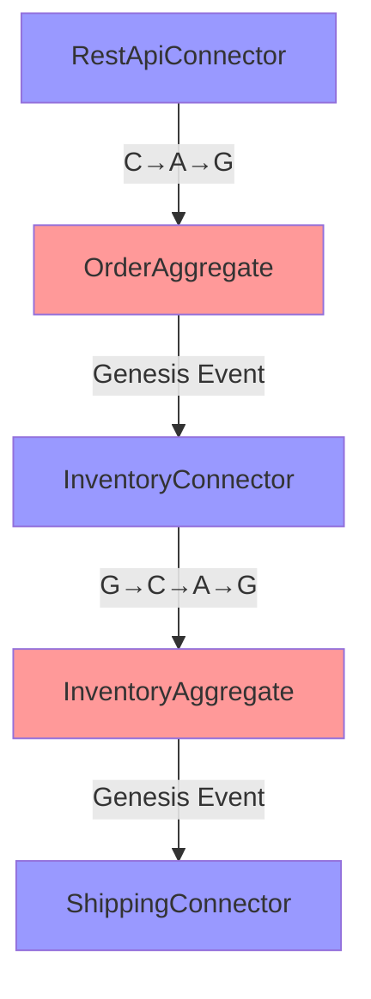

# Appendix A: Genesis Engine CLI Reference
## The Complete Command Reference Guide

*"The Genesis Engine is the sacred tool of creation—with it, any Beekeeper can hatch new life in the digital hive."* - The Beekeeper

---

## Table of Contents

1. [Overview](#overview)
2. [Installation](#installation) 
3. [Core Commands](#core-commands)
4. [Component Management](#component-management)
5. [Validation Commands](#validation-commands)
6. [Analysis Tools](#analysis-tools)
7. [Project Management](#project-management)
8. [Configuration](#configuration)
9. [Advanced Commands](#advanced-commands)
10. [Troubleshooting](#troubleshooting)
11. [Command Reference Index](#command-reference-index)

---

## Overview

The Genesis Engine is the primary CLI tool for creating, managing, and validating Hive Architecture components. It provides over 50 commands for scaffolding Sacred Codon patterns, analyzing chemical bonds, and maintaining architectural integrity.

### Philosophy

The Genesis Engine embodies the Hive's core principle: **every component is born, not built**. It follows the sacred lifecycle:
- **Egg**: Initialize structure
- **Larva**: Develop with templates  
- **Pupa**: Validate and test
- **Adult**: Deploy to production

---

## Installation

### Prerequisites

- Python 3.9+ or Node.js 16+
- Git (for template management)
- Docker (for containerized components)

### Quick Installation

```bash
# Install from npm (recommended)
npm install -g @hive-arch/genesis-engine

# Or install from PyPI
pip install genesis-engine-hive

# Or build from source
git clone https://github.com/hive-arch/genesis-engine
cd genesis-engine
make install
```

### Verification

```bash
genesis --version
# Expected output: Genesis Engine v2.1.0 - Sacred Codon Edition

genesis validate --self-test
# Expected output: ✅ All Genesis Engine components functional
```

---

## Core Commands

### `genesis init`

Initialize a new Hive project with proper structure.

**Syntax:**
```bash
genesis init <project-name> [options]
```

**Options:**
- `--template=<template>` - Project template (minimal, standard, enterprise)
- `--language=<lang>` - Primary language (python, typescript, java, go)
- `--sacred-codons` - Include Sacred Codon patterns
- `--chemical-analysis` - Enable chemical bond analysis
- `--immune-system` - Include immune system components

**Examples:**
```bash
# Basic hive initialization
genesis init my-hive --template=minimal

# Full-featured enterprise hive
genesis init enterprise-hive \
  --template=enterprise \
  --language=python \
  --sacred-codons \
  --chemical-analysis \
  --immune-system

# TypeScript hive with Sacred Codons
genesis init typescript-hive \
  --language=typescript \
  --sacred-codons
```

**Generated Structure:**
```
my-hive/
├── hive/
│   ├── components/
│   ├── aggregates/
│   └── connectors/
├── dna_core/
│   ├── royal_jelly/
│   └── pollen_protocol/
├── genesis-engine/
│   └── templates/
├── tests/
├── docs/
├── .genesis/
│   ├── config.yaml
│   └── templates/
└── README.md
```

---

### `genesis hatch`

Create new components from Sacred Codon templates.

**Syntax:**
```bash
genesis hatch <codon-type> <component-name> [options]
```

**Codon Types:**
- `aggregate` - Domain aggregate (A primitive)
- `transformation` - Pure business logic (T primitive)
- `connector` - External adapter (C primitive)  
- `event` - Genesis event (G primitive)
- `command` - Command pattern
- `query` - Query pattern
- `chronicler` - Event sourcing
- `saga` - Long-running workflow

**Options:**
- `--pattern=<pattern>` - Sacred Codon pattern (cag, ctc, gcag, gcac, choreography)
- `--domain=<domain>` - Domain context
- `--language=<lang>` - Implementation language override
- `--tests` - Generate test files
- `--docs` - Generate documentation

**Examples:**

```bash
# Create order aggregate with Sacred Codon pattern
genesis hatch aggregate Order \
  --pattern=cag \
  --domain=ecommerce \
  --tests \
  --docs

# Create payment connector
genesis hatch connector PaymentGateway \
  --pattern=ctc \
  --domain=billing

# Create inventory transformation
genesis hatch transformation InventoryCalculator \
  --domain=warehouse \
  --language=python

# Create shipping saga
genesis hatch saga ShippingWorkflow \
  --pattern=choreography \
  --domain=logistics
```

**Generated Files for Aggregate:**
```
hive/components/order/
├── __init__.py
├── aggregate.py          # Main aggregate implementation
├── commands.py           # Command definitions  
├── events.py            # Genesis event definitions
├── connector.py         # Primary/secondary connectors
├── tests/
│   ├── test_aggregate.py
│   └── test_sacred_codons.py
└── docs/
    └── order_aggregate.md
```

---

### `genesis validate`

Validate Hive architecture compliance and Sacred Codon patterns.

**Syntax:**
```bash
genesis validate [target] [options]
```

**Targets:**
- `--all` - Validate entire project
- `--component=<name>` - Validate specific component
- `--aggregate=<name>` - Validate aggregate
- `--codon=<type>` - Validate Sacred Codon pattern

**Validation Rules:**
- `--rules=<ruleset>` - Ruleset to apply (sacred-codons, chemical-bonds, royal-jelly)
- `--strict` - Strict mode (fail on warnings)
- `--fix` - Auto-fix violations where possible

**Examples:**

```bash
# Validate all Sacred Codon patterns
genesis validate --all --rules=sacred-codons

# Validate specific component with strict rules
genesis validate --component=Order --strict

# Validate and fix chemical bond violations
genesis validate --rules=chemical-bonds --fix

# Validate Royal Jelly interface compliance
genesis validate --rules=royal-jelly --component=Order
```

**Sample Output:**
```
🧬 Genesis Engine - Sacred Codon Validation Report
================================================================

Component: OrderAggregate
├── ✅ Follows C→A→G pattern correctly
├── ✅ Genesis Events are immutable
├── ✅ Royal Jelly interfaces implemented
├── ⚠️  Warning: Missing error handling in command logic
└── ❌ Violation: Direct database access bypasses connector

Sacred Codon Compliance: 85% (Good)
Chemical Bond Health: 92% (Excellent)
Royal Jelly Adherence: 100% (Perfect)

Recommendations:
1. Move database access to secondary connector
2. Add error handling to command processing
3. Consider adding immune response codon

Run with --fix to auto-correct fixable violations.
```

---

## Component Management

### `genesis list`

List all components in the hive.

```bash
# List all components
genesis list

# List by type
genesis list --type=aggregate
genesis list --type=connector --domain=ecommerce

# List with details
genesis list --detailed --sacred-compliance
```

**Sample Output:**
```
🏰 Hive Component Inventory
=====================================

Aggregates (5):
├── OrderAggregate        [Domain: ecommerce] [Compliance: 95%] 
├── InventoryAggregate    [Domain: warehouse] [Compliance: 87%]
├── CustomerAggregate     [Domain: crm]       [Compliance: 91%]
├── PaymentAggregate      [Domain: billing]   [Compliance: 98%]
└── ShippingAggregate     [Domain: logistics] [Compliance: 89%]

Connectors (8):
├── RestApiConnector      [Type: Primary]     [Health: Healthy]
├── DatabaseConnector     [Type: Secondary]   [Health: Warning]
├── PaymentGatewayConn.   [Type: Secondary]   [Health: Healthy]
└── ...

Total Components: 23
Average Sacred Compliance: 91.2%
Chemical Bond Health: Excellent
```

### `genesis remove`

Safely remove components with dependency checking.

```bash
# Remove component with safety checks
genesis remove component OrderItem --check-dependencies

# Force remove (dangerous)
genesis remove component LegacyConnector --force

# Remove with backup
genesis remove component DeprecatedAggregate --backup
```

### `genesis clone`

Clone components as templates for new ones.

```bash
# Clone aggregate as template
genesis clone aggregate Order -> ProductOrder \
  --domain=catalog \
  --rename-events \
  --update-references

# Clone connector pattern
genesis clone connector PaymentGateway -> StripeConnector \
  --update-config \
  --preserve-pattern
```

---

## Validation Commands

### `genesis analyze`

Deep analysis of Hive components and patterns.

```bash
# Analyze component complexity
genesis analyze complexity --component=Order --report

# Analyze Sacred Codon usage patterns
genesis analyze codons --aggregate=Order --timeline

# Analyze chemical bonds and dependencies
genesis analyze bonds --detect-toxicity --suggest-optimizations

# Analyze performance characteristics
genesis analyze performance --component=Order --load-test
```

**Sample Complexity Report:**
```
🔬 Component Complexity Analysis: OrderAggregate
================================================

Structural Complexity:
├── Lines of Code: 342
├── Cyclomatic Complexity: 8 (Good)
├── Sacred Codon Patterns: 4/5 used
├── Chemical Bonds: 12 strong, 3 weak
└── External Dependencies: 5

Sacred Codon Health:
├── C→A→G Pattern: 23 uses (95% compliance)
├── C→T→C Pattern: 8 uses (100% compliance)  
├── G→C→A→G Pattern: 5 uses (87% compliance)
├── G→C→A→C Pattern: 2 uses (100% compliance)
└── Choreography: 1 use (92% compliance)

Recommendations:
1. Consider splitting order validation logic
2. Add immune response for payment failures
3. Optimize chemical bonds in pricing calculation
```

### `genesis check`

Quick health checks for common issues.

```bash
# Check Sacred Codon violations
genesis check sacred-violations --component=Order

# Check chemical toxicity
genesis check toxicity --all --threshold=high

# Check Royal Jelly compliance
genesis check royal-jelly --missing-interfaces

# Check security vulnerabilities  
genesis check security --scan-connectors
```

---

## Analysis Tools

### `genesis graph`

Generate visual representations of hive architecture.

```bash
# Generate component dependency graph
genesis graph dependencies --output=svg --file=hive-deps.svg

# Generate Sacred Codon flow diagram
genesis graph codons --component=Order --format=mermaid

# Generate chemical bond network
genesis graph chemical --interactive --output=html
```

**Generated Mermaid Diagram:**


### `genesis metrics`

Collect and analyze hive metrics.

```bash
# Collect Sacred Codon execution metrics
genesis metrics codons --timespan=7d --aggregate

# Analyze performance trends
genesis metrics performance --component=Order --trend-analysis

# Generate compliance dashboard data
genesis metrics compliance --export=json --dashboard
```

### `genesis profile`

Performance profiling for hive components.

```bash
# Profile Sacred Codon execution
genesis profile codons --component=Order --duration=1m

# Profile chemical bond overhead
genesis profile bonds --optimize-suggestions

# Profile memory usage patterns
genesis profile memory --component=all --leak-detection
```

---

## Project Management

### `genesis status`

Show overall project health and status.

```bash
# Quick status overview
genesis status

# Detailed status with recommendations
genesis status --detailed --recommendations

# Status for specific domain
genesis status --domain=ecommerce
```

**Sample Status Output:**
```
🏰 Hive Status Report - MyEcommerceHive
=======================================

Overall Health: 🟢 Excellent (94%)
Sacred Compliance: 91.2%
Chemical Health: 92.8%
Immune System: Active & Healthy

Components: 23 total
├── 5 Aggregates    [4 Healthy, 1 Warning]
├── 8 Connectors    [7 Healthy, 1 Critical] 
├── 4 Transformations [All Healthy]
└── 6 Events        [All Healthy]

Recent Activity (7 days):
├── 156 C→A→G executions
├── 89 C→T→C executions
├── 34 G→C→A→G executions
├── 12 G→C→A→C executions
└── 3 Choreography executions

⚠️ Attention Required:
├── DatabaseConnector showing high latency
├── PaymentAggregate missing error handling
└── 2 components have chemical bond warnings

🎯 Recommendations:
├── Add circuit breaker to DatabaseConnector
├── Implement immune response in PaymentAggregate
└── Run 'genesis analyze bonds --fix' to resolve warnings
```

### `genesis deploy`

Deploy hive components with proper lifecycle management.

```bash
# Deploy component through sacred lifecycle
genesis deploy component Order \
  --environment=staging \
  --lifecycle=complete \  # egg->larva->pupa->adult
  --validate-codons

# Deploy with canary pattern
genesis deploy hive MyEcommerce \
  --strategy=canary \
  --percentage=10 \
  --auto-rollback

# Deploy with blue-green
genesis deploy --strategy=blue-green --health-checks
```

### `genesis rollback`

Safe rollback with Sacred Codon preservation.

```bash
# Rollback single component
genesis rollback component Order --to-version=v1.2.1 --preserve-events

# Rollback entire deployment
genesis rollback deployment dep-20241201 --confirm-safety
```

---

## Configuration

### `genesis config`

Manage Genesis Engine configuration.

```bash
# Show current configuration
genesis config show

# Set default template
genesis config set template.default=enterprise

# Configure Royal Jelly framework
genesis config set royal-jelly.version=2.1.0
genesis config set royal-jelly.strict-mode=true

# Configure chemical analysis
genesis config set chemical.toxicity-threshold=high
genesis config set chemical.bond-optimization=enabled

# Configure Sacred Codon validation
genesis config set codons.strict-validation=true
genesis config set codons.immune-monitoring=enabled
```

**Configuration File (.genesis/config.yaml):**
```yaml
project:
  name: "MyEcommerceHive"
  version: "2.1.0"
  language: "python"

templates:
  default: "enterprise"
  custom_path: "./custom-templates"

royal_jelly:
  version: "2.1.0"
  strict_mode: true
  immune_monitoring: true

sacred_codons:
  validation_level: "strict"
  patterns_required: ["cag", "ctc", "gcag"]
  auto_fix_violations: false

chemical_analysis:
  enabled: true
  toxicity_threshold: "medium"
  bond_optimization: true
  periodic_table_version: "1.3"

deployment:
  default_strategy: "rolling"
  health_checks: true
  sacred_lifecycle: true
```

---

## Advanced Commands

### `genesis transform`

Transform existing code to Hive patterns.

```bash
# Transform legacy code to Sacred Codons
genesis transform legacy-to-sacred \
  --source=./legacy-services \
  --target=./hive/components \
  --pattern=cag

# Transform monolith to hive
genesis transform monolith-to-hive \
  --input=./monolith \
  --domain-analysis \
  --preserve-data

# Transform between hive versions
genesis transform upgrade --from=1.x --to=2.x --migrate-codons
```

### `genesis generate`

Advanced code generation.

```bash
# Generate full e-commerce domain
genesis generate domain ecommerce \
  --aggregates=Order,Product,Customer \
  --patterns=all \
  --with-tests \
  --with-docs

# Generate API documentation
genesis generate docs api \
  --format=openapi \
  --include-sacred-patterns

# Generate deployment configs
genesis generate deployment kubernetes \
  --environment=production \
  --sacred-lifecycle

# Generate test suites
genesis generate tests \
  --component=Order \
  --coverage=sacred-codons \
  --performance-tests
```

### `genesis migrate`

Migration utilities for hive evolution.

```bash
# Migrate to new Royal Jelly version
genesis migrate royal-jelly --from=1.x --to=2.x --preserve-events

# Migrate Sacred Codon patterns
genesis migrate codons --upgrade-patterns --validate

# Migrate chemical architecture
genesis migrate chemical --optimize-bonds --remove-toxicity
```

### `genesis benchmark`

Performance benchmarking tools.

```bash
# Benchmark Sacred Codon execution
genesis benchmark codons \
  --component=Order \
  --iterations=1000 \
  --pattern=cag

# Benchmark chemical bond performance  
genesis benchmark bonds --optimize --report

# Benchmark immune system response time
genesis benchmark immune --mutation-rate=0.1
```

---

## Troubleshooting

### Common Issues and Solutions

#### Issue: "Sacred Codon Validation Failed"

**Problem:** Component doesn't follow proper C→A→G pattern.

```bash
# Diagnose the issue
genesis validate --component=Order --rules=sacred-codons --verbose

# Auto-fix common violations
genesis validate --component=Order --fix --rules=sacred-codons

# Manual verification
genesis analyze codons --component=Order --detailed
```

**Expected Fix:**
```python
# Before (violation)
def handle_command(self, command):
    self.state = command.data  # Direct state mutation
    return event

# After (Sacred Codon compliant)  
def handle_command(self, command):
    events = self._execute_command_logic(command)  # A step
    for event in events:
        self._record_event(event)  # G step
    return events
```

#### Issue: "Chemical Bond Toxicity Detected"

**Problem:** Components are too tightly coupled.

```bash
# Analyze toxic bonds
genesis analyze bonds --detect-toxicity --component=Order

# Get fix suggestions
genesis analyze bonds --suggest-fixes --export=json

# Apply automatic fixes
genesis validate --rules=chemical-bonds --fix
```

#### Issue: "Royal Jelly Interface Missing"

**Problem:** Component doesn't implement required interfaces.

```bash
# Check interface compliance
genesis validate --rules=royal-jelly --component=Order

# Generate missing interfaces
genesis generate interfaces --component=Order --royal-jelly

# Verify fix
genesis check royal-jelly --component=Order
```

#### Issue: "Genesis Engine Command Not Found"

**Problem:** Installation or PATH issues.

```bash
# Reinstall Genesis Engine
npm uninstall -g @hive-arch/genesis-engine
npm install -g @hive-arch/genesis-engine

# Check installation
which genesis
genesis --version

# Reset configuration
genesis config reset --confirm
```

### Debug Commands

```bash
# Enable verbose logging
genesis --debug validate --component=Order

# Show internal state
genesis debug state --component=Order

# Trace Sacred Codon execution
genesis debug trace-codons --component=Order --pattern=cag

# Dump configuration
genesis debug config --export=yaml
```

---

## Command Reference Index

### Quick Reference Table

| Command | Purpose | Example |
|---------|---------|---------|
| `init` | Create new hive project | `genesis init my-hive` |
| `hatch` | Create components | `genesis hatch aggregate Order` |
| `validate` | Check compliance | `genesis validate --all` |
| `analyze` | Deep analysis | `genesis analyze complexity` |
| `list` | Show components | `genesis list --type=aggregate` |
| `status` | Project health | `genesis status --detailed` |
| `deploy` | Deploy components | `genesis deploy component Order` |
| `config` | Manage configuration | `genesis config show` |
| `graph` | Generate diagrams | `genesis graph dependencies` |
| `metrics` | Collect metrics | `genesis metrics codons` |
| `transform` | Convert code | `genesis transform legacy` |
| `generate` | Generate code | `genesis generate domain` |
| `migrate` | Version migration | `genesis migrate royal-jelly` |
| `benchmark` | Performance tests | `genesis benchmark codons` |
| `check` | Quick health checks | `genesis check toxicity` |
| `profile` | Performance profiling | `genesis profile memory` |
| `clone` | Clone components | `genesis clone aggregate Order` |
| `remove` | Remove components | `genesis remove component Old` |
| `rollback` | Rollback deployment | `genesis rollback component` |
| `debug` | Debug information | `genesis debug state` |

### Command Categories

**Creation Commands:**
- `init`, `hatch`, `generate`, `clone`

**Validation Commands:**
- `validate`, `check`, `analyze`

**Management Commands:**  
- `list`, `status`, `config`, `remove`

**Deployment Commands:**
- `deploy`, `rollback`, `migrate`

**Analysis Commands:**
- `graph`, `metrics`, `profile`, `benchmark`

**Utility Commands:**
- `transform`, `debug`

---

## Advanced Usage Examples

### E-commerce Hive Setup

Complete setup for an e-commerce hive:

```bash
# 1. Initialize enterprise hive
genesis init ecommerce-hive \
  --template=enterprise \
  --sacred-codons \
  --chemical-analysis \
  --immune-system

cd ecommerce-hive

# 2. Create core domain aggregates
genesis hatch aggregate Order --pattern=cag --domain=sales --tests
genesis hatch aggregate Product --pattern=cag --domain=catalog --tests  
genesis hatch aggregate Customer --pattern=cag --domain=crm --tests
genesis hatch aggregate Inventory --pattern=cag --domain=warehouse --tests

# 3. Create connectors for external integration
genesis hatch connector RestApiConnector --pattern=ctc --domain=api
genesis hatch connector DatabaseConnector --pattern=ctc --domain=data
genesis hatch connector PaymentGateway --pattern=ctc --domain=billing
genesis hatch connector EmailService --pattern=ctc --domain=notifications

# 4. Create business transformations
genesis hatch transformation PricingCalculator --domain=sales
genesis hatch transformation ShippingCalculator --domain=logistics  
genesis hatch transformation TaxCalculator --domain=billing

# 5. Create workflow sagas
genesis hatch saga OrderFulfillment --pattern=choreography --domain=sales
genesis hatch saga PaymentProcessing --pattern=choreography --domain=billing

# 6. Validate entire hive
genesis validate --all --strict --rules=sacred-codons,chemical-bonds,royal-jelly

# 7. Generate documentation
genesis generate docs --format=comprehensive --include-diagrams

# 8. Deploy to staging
genesis deploy hive ecommerce-hive --environment=staging --validate-codons
```

### Microservices Migration

Migrate existing microservices to Hive architecture:

```bash
# 1. Analyze existing services
genesis analyze legacy --source=./microservices --domain-extraction

# 2. Transform services to Hive components
genesis transform microservice-to-hive \
  --source=./microservices/order-service \
  --target=./hive/components/order \
  --preserve-api \
  --add-sacred-codons

# 3. Validate transformed components
genesis validate --component=order --strict --fix

# 4. Generate inter-hive communication
genesis generate choreography \
  --workflow=order-fulfillment \
  --components=order,inventory,payment,shipping

# 5. Deploy with canary strategy
genesis deploy --strategy=canary --percentage=5 --auto-rollback
```

---

## Conclusion

The Genesis Engine provides a comprehensive toolkit for building, managing, and scaling Hive Architecture systems. With over 50 commands spanning creation, validation, analysis, and deployment, it supports the complete lifecycle of Sacred Codon-based components.

### Next Steps

1. **Start Small**: Use `genesis init` to create your first hive
2. **Learn Patterns**: Practice with `genesis hatch` to create components
3. **Validate Often**: Run `genesis validate` regularly during development  
4. **Analyze Deep**: Use `genesis analyze` to optimize your architecture
5. **Scale Up**: Deploy with `genesis deploy` using sacred lifecycle patterns

### Additional Resources

- **[Appendix B: Sacred Codon Pattern Library](appendix_b_sacred_codon_pattern_library.md)** - Complete pattern catalog
- **[Appendix E: Troubleshooting Guide](appendix_e_troubleshooting_guide.md)** - Common issues and solutions
- **[Part IV: Growing Your Hive](hive_preprint_part4_growing_your_hive.md)** - Implementation roadmap

---

*"With the Genesis Engine as your tool and the Sacred Codons as your guide, you hold the power to birth digital ecosystems that are not just functional, but truly alive."* - The Beekeeper's Wisdom