```mermaid
graph TD
    subgraph "Choreography Pattern"
        A[Step 1: C→A→G] --> B[Step 2: G→C→A→G]
        B --> C[Step 3: C→T→C]
        C --> D[Step 4: G→C→A→G]  
        D --> E[Step 5: G→C→A→C]
        
        F[Failure Handler] --> G[Compensation: G→C→A→C]
        
        A -.-> F
        B -.-> F
        C -.-> F
        D -.-> F
    end
```

# Appendix B: Sacred Codon Pattern Library
## The Complete Catalog of Life Patterns

*"The Sacred Codons are the genetic instructions of digital life—master them, and you master the art of building living systems."* - The Beekeeper

---

## Table of Contents

1. [Overview of Sacred Codons](#overview-of-sacred-codons)
2. [Pattern 1: C→A→G (Handle Command)](#pattern-1-cag-handle-command)
3. [Pattern 2: C→T→C (Query Data)](#pattern-2-ctc-query-data)
4. [Pattern 3: G→C→A→G (React to Event)](#pattern-3-gcag-react-to-event)
5. [Pattern 4: G→C→A→C (Immune Response)](#pattern-4-gcac-immune-response)
6. [Pattern 5: Choreography (Complex Workflows)](#pattern-5-choreography-complex-workflows)
7. [Advanced Pattern Combinations](#advanced-pattern-combinations)
8. [Anti-Patterns and Violations](#anti-patterns-and-violations)
9. [Validation Rules](#validation-rules)
10. [Code Templates by Language](#code-templates-by-language)
11. [Pattern Selection Guide](#pattern-selection-guide)

---

## Overview of Sacred Codons

The Sacred Codons are the five fundamental interaction patterns that govern all life in the Hive. Just as DNA codons code for amino acids in biological systems, Sacred Codons code for behavioral patterns in software systems.

### The Five Sacred Patterns

```mermaid
graph TD
    subgraph "Sacred Codon Patterns"
        CAG["🎯 C→A→G<br/>Handle Command<br/>(To Change)"]
        CTC["🔍 C→T→C<br/>Query Data<br/>(To See)"] 
        GCAG["🎭 G→C→A→G<br/>React to Event<br/>(To Listen)"]
        GCAC["🏥 G→C→A→C<br/>Immune Response<br/>(To Heal)"]
        CHORE["🎪 Choreography<br/>Complex Workflow<br/>(To Become)"]
        
        style CAG fill:#ff9999
        style CTC fill:#99ff99  
        style GCAG fill:#9999ff
        style GCAC fill:#ffff99
        style CHORE fill:#ff99ff
    end
```



### Genetic Principles

Each Sacred Codon follows these principles:

1. **Immutable Pattern**: The sequence cannot be altered
2. **Atomic Execution**: All steps must complete or none
3. **Event Sourcing**: All state changes generate Genesis Events
4. **Chemical Bonds**: Proper element relationships (ATCG)
5. **Royal Jelly Compliance**: Implements standard interfaces

---

## Pattern 1: C→A→G (Handle Command)

**Purpose**: The fundamental pattern for changing system state safely and consistently.

**When to Use**: 
- Creating new entities
- Updating existing state
- Processing business commands
- Any operation that changes the system

**Chemical Formula**: `C (Connector) + A (Aggregate) → G (Genesis Event)`

### Pattern Structure


### Implementation Template

```python
class SacredCommandHandler:
    """Template for C→A→G pattern implementation"""
    
    def handle_command_cag(self, external_request: Dict[str, Any]) -> List[PollenEnvelope]:
        """
        Sacred Codon: C→A→G (Handle Command)
        
        This is the ONLY pattern that should change system state.
        """
        
        # === C STEP: Connector Phase ===
        # Validate and translate external input
        command = self._translate_external_to_command(external_request)
        self._validate_command_format(command)
        
        # === A STEP: Aggregate Phase ===
        # Execute business logic and rules
        aggregate = self._load_aggregate(command.aggregate_id)
        events = aggregate.handle_command(command)
        
        # === G STEP: Genesis Event Phase ===
        # Record events and update state
        for event in events:
            self._store_event(event)
            aggregate.apply_event(event)
        
        # Publish events for other components
        self._publish_events(events)
        
        return events
    
    def _translate_external_to_command(self, request: Dict[str, Any]) -> SacredCommand:
        """Convert external format to internal command"""
        return create_sacred_command(
            command_type=request["action"],
            payload=request["data"],
            codon_type=SacredCodonType.HANDLE_COMMAND,
            source="external_api"
        )
    
    def _validate_command_format(self, command: SacredCommand) -> None:
        """Validate command follows Sacred Codon structure"""
        if not command.command_id:
            raise ValueError("Command missing unique ID")
        if not command.payload:
            raise ValueError("Command missing payload")
        if command.codon_type != SacredCodonType.HANDLE_COMMAND:
            raise ValueError("Invalid codon type for C→A→G pattern")
```

### Real-World Examples

#### E-commerce Order Creation

```python
class OrderCreationHandler:
    """Real example: Creating orders using C→A→G pattern"""
    
    def create_order(self, order_request: Dict[str, Any]) -> List[PollenEnvelope]:
        """
        Example: POST /orders
        {
          "customer_id": "cust-123",
          "items": [{"product_id": "prod-456", "quantity": 2}],
          "shipping_address": {...}
        }
        """
        
        # C: Connector translates HTTP request to domain command
        command = SacredCommand(
            command_id=str(uuid.uuid4()),
            command_type="create_order",
            payload={
                "customer_id": order_request["customer_id"],
                "items": order_request["items"],
                "shipping_address": order_request["shipping_address"],
                "order_date": datetime.utcnow().isoformat()
            },
            codon_type=SacredCodonType.HANDLE_COMMAND,
            timestamp=datetime.utcnow(),
            source="rest_api"
        )
        
        # A: Aggregate processes business logic
        order_aggregate = OrderAggregate(str(uuid.uuid4()))
        events = order_aggregate.handle_command(command)
        
        # Expected events:
        # - OrderCreatedEvent
        # - InventoryReservedEvent (if auto-reserve enabled)
        # - CustomerNotifiedEvent
        
        # G: Genesis Events are stored and published
        for event in events:
            self.event_store.append(event)
            self.event_bus.publish(event)
        
        return events

class OrderAggregate(SacredAggregate):
    """Order aggregate implementing C→A→G pattern"""
    
    def _execute_command_logic(self, command: SacredCommand) -> List[PollenEnvelope]:
        if command.command_type == "create_order":
            return self._create_order_logic(command)
        elif command.command_type == "add_item":
            return self._add_item_logic(command)
        elif command.command_type == "cancel_order":
            return self._cancel_order_logic(command)
        else:
            raise ValueError(f"Unknown command: {command.command_type}")
    
    def _create_order_logic(self, command: SacredCommand) -> List[PollenEnvelope]:
        """Business logic for order creation"""
        payload = command.payload
        
        # Business rule validation
        if not payload.get("items"):
            raise ValueError("Order must contain items")
        
        if len(payload["items"]) > 50:
            raise ValueError("Order cannot contain more than 50 items")
        
        # Calculate totals
        total_amount = sum(
            item["quantity"] * self._get_product_price(item["product_id"]) 
            for item in payload["items"]
        )
        
        # Update aggregate state
        self.status = "created"
        self.items = payload["items"]
        self.customer_id = payload["customer_id"]
        self.total_amount = total_amount
        
        # Generate Genesis Events
        events = [
            self._create_event("OrderCreatedEvent", {
                "order_id": self.id,
                "customer_id": payload["customer_id"],
                "items": payload["items"],
                "total_amount": total_amount,
                "status": "created"
            })
        ]
        
        # Conditional event generation based on business rules
        if self._should_auto_reserve_inventory():
            events.append(self._create_event("InventoryReservationRequested", {
                "order_id": self.id,
                "items": payload["items"]
            }))
        
        return events
```

### Validation Checklist

✅ **C Step Validation:**
- [ ] External input properly validated
- [ ] Command object created with unique ID
- [ ] Codon type set to HANDLE_COMMAND
- [ ] Source system identified

✅ **A Step Validation:**
- [ ] Business rules enforced
- [ ] State changes only through events
- [ ] Error handling implemented
- [ ] Aggregate boundaries respected

✅ **G Step Validation:**
- [ ] Events are immutable
- [ ] Event versioning implemented
- [ ] Events stored before state application
- [ ] Events published for other components

---

## Pattern 2: C→T→C (Query Data)

**Purpose**: Pure data retrieval and projection without side effects.

**When to Use**:
- Reading system state
- Generating reports
- Data transformations
- API queries that don't change state

**Chemical Formula**: `C (Connector) + T (Transformation) → C (Connector)`

### Pattern Structure


### Implementation Template

```python
class SacredQueryHandler:
    """Template for C→T→C pattern implementation"""
    
    def handle_query_ctc(self, query_request: Dict[str, Any]) -> Dict[str, Any]:
        """
        Sacred Codon: C→T→C (Query Data)
        
        This pattern MUST be pure - no state changes allowed.
        """
        
        # === C STEP: Input Connector Phase ===
        # Validate and translate query
        query = self._translate_external_to_query(query_request)
        self._validate_query_format(query)
        
        # === T STEP: Transformation Phase ===
        # Pure data processing - no side effects
        raw_data = self._fetch_raw_data(query)
        transformed_data = self._apply_transformation(raw_data, query)
        
        # === C STEP: Output Connector Phase ===
        # Format for external consumption
        result = self._format_for_external(transformed_data, query)
        
        return result
    
    def _translate_external_to_query(self, request: Dict[str, Any]) -> SacredCommand:
        """Convert external query to internal query object"""
        return create_sacred_command(
            command_type="query_data",
            payload=request,
            codon_type=SacredCodonType.QUERY_DATA,
            source="query_api"
        )
    
    def _apply_transformation(self, raw_data: List[Dict], query: SacredCommand) -> Dict[str, Any]:
        """Pure transformation logic - no side effects"""
        # This must be a pure function
        # Input: raw_data, query parameters
        # Output: transformed data
        # No external calls, no state changes, no side effects
        
        transformation = self._get_transformation(query.payload["transform_type"])
        return transformation.execute(raw_data)
```

### Real-World Examples

#### Order Status Query

```python
class OrderStatusQuery:
    """Real example: Querying order status using C→T→C pattern"""
    
    def get_order_status(self, customer_id: str, order_id: str) -> Dict[str, Any]:
        """
        Example: GET /customers/123/orders/456/status
        Returns current order status with calculated fields
        """
        
        # C: Input connector validates and translates request
        query = SacredCommand(
            command_id=str(uuid.uuid4()),
            command_type="get_order_status",
            payload={
                "customer_id": customer_id,
                "order_id": order_id,
                "include_items": True,
                "include_history": True
            },
            codon_type=SacredCodonType.QUERY_DATA,
            timestamp=datetime.utcnow(),
            source="status_api"
        )
        
        # T: Pure transformation processes the data
        order_status = self._get_order_status_transformation(query)
        
        # C: Output connector formats for API response
        return {
            "order_id": order_id,
            "status": order_status["status"],
            "progress_percentage": order_status["progress"],
            "estimated_delivery": order_status["delivery_estimate"],
            "items": order_status["items"],
            "status_history": order_status["history"],
            "last_updated": order_status["last_updated"]
        }
    
    def _get_order_status_transformation(self, query: SacredCommand) -> Dict[str, Any]:
        """Pure transformation - no side effects"""
        payload = query.payload
        
        # Fetch raw data from multiple sources
        order_data = self.order_repository.get_by_id(payload["order_id"])
        shipping_data = self.shipping_repository.get_by_order_id(payload["order_id"])
        payment_data = self.payment_repository.get_by_order_id(payload["order_id"])
        
        # Pure calculation logic
        progress_calculator = OrderProgressTransformation()
        delivery_estimator = DeliveryEstimationTransformation()
        
        # Calculate derived values
        progress_percentage = progress_calculator.calculate_progress(
            order_data, shipping_data, payment_data
        )
        
        delivery_estimate = delivery_estimator.estimate_delivery(
            order_data["shipping_address"],
            shipping_data.get("carrier_info"),
            order_data["created_at"]
        )
        
        return {
            "status": order_data["status"],
            "progress": progress_percentage,
            "delivery_estimate": delivery_estimate,
            "items": order_data["items"],
            "history": self._build_status_history(order_data, shipping_data, payment_data),
            "last_updated": max(
                order_data["updated_at"],
                shipping_data.get("updated_at", order_data["updated_at"]),
                payment_data.get("updated_at", order_data["updated_at"])
            )
        }

class OrderProgressTransformation(Transformation):
    """Pure transformation for calculating order progress"""
    
    def execute(self, order_data: Dict, shipping_data: Dict, payment_data: Dict) -> float:
        """Calculate order progress percentage (0-100)"""
        progress_steps = {
            "order_placed": 10,
            "payment_confirmed": 25,
            "items_reserved": 35,
            "items_picked": 50,
            "items_packed": 65,
            "shipped": 80,
            "out_for_delivery": 90,
            "delivered": 100
        }
        
        current_status = order_data["status"]
        return progress_steps.get(current_status, 0)

class DeliveryEstimationTransformation(Transformation):
    """Pure transformation for estimating delivery dates"""
    
    def execute(self, shipping_address: Dict, carrier_info: Dict, order_date: str) -> str:
        """Estimate delivery date based on shipping info"""
        # Pure calculation logic
        base_delivery_days = carrier_info.get("estimated_days", 3)
        
        # Adjust for shipping address
        if shipping_address.get("country") != "US":
            base_delivery_days += 2
        
        if shipping_address.get("is_rural", False):
            base_delivery_days += 1
        
        # Calculate delivery date
        order_datetime = datetime.fromisoformat(order_date)
        estimated_delivery = order_datetime + timedelta(days=base_delivery_days)
        
        return estimated_delivery.isoformat()
```

#### Customer Analytics Query

```python
class CustomerAnalyticsQuery:
    """Complex analytics query using C→T→C pattern"""
    
    def get_customer_insights(self, customer_id: str, timespan: str = "30d") -> Dict[str, Any]:
        """Generate customer behavioral insights"""
        
        # C: Validate and structure query
        query = create_sacred_command(
            command_type="customer_analytics",
            payload={
                "customer_id": customer_id,
                "timespan": timespan,
                "include_predictions": True,
                "include_segments": True
            },
            codon_type=SacredCodonType.QUERY_DATA,
            source="analytics_api"
        )
        
        # T: Pure analytical transformations
        analytics_result = self._compute_customer_analytics(query)
        
        # C: Format for consumption
        return self._format_analytics_response(analytics_result)
    
    def _compute_customer_analytics(self, query: SacredCommand) -> Dict[str, Any]:
        """Pure analytical computation"""
        customer_id = query.payload["customer_id"]
        timespan = query.payload["timespan"]
        
        # Fetch raw data (read-only operations)
        orders = self.order_repository.get_by_customer_and_timespan(customer_id, timespan)
        sessions = self.session_repository.get_by_customer_and_timespan(customer_id, timespan)
        products = self.product_repository.get_by_customer_purchases(customer_id)
        
        # Pure transformations
        order_analyzer = CustomerOrderAnalyzer()
        behavior_analyzer = CustomerBehaviorAnalyzer()
        segmentation_engine = CustomerSegmentationEngine()
        
        # Compute insights
        order_insights = order_analyzer.analyze(orders)
        behavior_insights = behavior_analyzer.analyze(sessions, orders)
        customer_segment = segmentation_engine.classify(orders, behavior_insights)
        
        return {
            "customer_id": customer_id,
            "timespan": timespan,
            "order_insights": order_insights,
            "behavior_insights": behavior_insights,
            "customer_segment": customer_segment,
            "computed_at": datetime.utcnow().isoformat()
        }
```

### Validation Checklist

✅ **C Step (Input) Validation:**
- [ ] Query parameters validated
- [ ] Query object created properly
- [ ] Codon type set to QUERY_DATA
- [ ] No state changes in validation

✅ **T Step Validation:**
- [ ] Pure functions only (no side effects)
- [ ] No external API calls that change state
- [ ] No database writes
- [ ] Deterministic output for same input
- [ ] Error handling without state changes

✅ **C Step (Output) Validation:**
- [ ] Result properly formatted
- [ ] No sensitive data exposed
- [ ] Response structure consistent
- [ ] No side effects during formatting

---

## Pattern 3: G→C→A→G (React to Event)

**Purpose**: Event-driven choreography and inter-component communication.

**When to Use**:
- Reacting to events from other components
- Implementing sagas and workflows
- Event-driven architecture
- Loose coupling between domains

**Chemical Formula**: `G (Genesis Event) + C (Connector) + A (Aggregate) → G (Genesis Event)`

### Pattern Structure


### Implementation Template

```python
class SacredEventReactionHandler:
    """Template for G→C→A→G pattern implementation"""
    
    def handle_event_reaction_gcag(self, incoming_event: PollenEnvelope) -> List[PollenEnvelope]:
        """
        Sacred Codon: G→C→A→G (React to Event)
        
        This pattern enables choreography between components.
        """
        
        # === G STEP: Genesis Event Arrives ===
        # Validate incoming event structure
        self._validate_event_format(incoming_event)
        
        # === C STEP: Connector Translation Phase ===
        # Convert event to internal reaction command
        reaction_command = self._translate_event_to_command(incoming_event)
        self._validate_reaction_command(reaction_command)
        
        # === A STEP: Aggregate Reaction Phase ===
        # Execute business logic in response to event
        aggregate = self._load_or_create_aggregate(reaction_command)
        response_events = aggregate.handle_reaction(incoming_event, reaction_command)
        
        # === G STEP: Genesis Event Generation ===
        # Store and publish reaction events
        for event in response_events:
            self._store_event(event)
            self._publish_event(event)
        
        return response_events
    
    def _translate_event_to_command(self, event: PollenEnvelope) -> SacredCommand:
        """Convert incoming event to reaction command"""
        return create_sacred_command(
            command_type=f"react_to_{event.event_type}",
            payload=dict(event.payload),
            codon_type=SacredCodonType.REACT_TO_EVENT,
            source=f"event_reaction_{event.event_id}"
        )
```

### Real-World Examples

#### Order Fulfillment Workflow

```python
class OrderFulfillmentReactionHandler:
    """React to OrderCreatedEvent to start fulfillment process"""
    
    def handle_order_created(self, order_created_event: PollenEnvelope) -> List[PollenEnvelope]:
        """
        React to OrderCreatedEvent from Order domain
        Trigger inventory reservation and payment processing
        """
        
        # G: OrderCreatedEvent arrives from Order Aggregate
        print(f"📦 Received OrderCreatedEvent: {order_created_event.event_id}")
        
        # C: Translate event to fulfillment commands
        order_data = dict(order_created_event.payload)
        
        fulfillment_command = create_sacred_command(
            command_type="start_order_fulfillment",
            payload={
                "order_id": order_data["order_id"],
                "customer_id": order_data["customer_id"],
                "items": order_data["items"],
                "fulfillment_priority": self._calculate_priority(order_data),
                "original_event_id": order_created_event.event_id
            },
            codon_type=SacredCodonType.REACT_TO_EVENT,
            source="fulfillment_service"
        )
        
        # A: Execute fulfillment logic
        fulfillment_aggregate = self._get_fulfillment_aggregate(order_data["order_id"])
        reaction_events = fulfillment_aggregate.start_fulfillment(fulfillment_command)
        
        # G: Generate reaction events
        # Expected events:
        # - FulfillmentStartedEvent
        # - InventoryReservationRequestedEvent  
        # - PaymentProcessingRequestedEvent
        
        return reaction_events

class FulfillmentAggregate(SacredAggregate):
    """Aggregate that handles order fulfillment reactions"""
    
    def start_fulfillment(self, command: SacredCommand) -> List[PollenEnvelope]:
        """Start the fulfillment process"""
        order_data = command.payload
        
        # Business logic for fulfillment
        fulfillment_steps = self._plan_fulfillment_steps(order_data)
        
        # Update aggregate state
        self.order_id = order_data["order_id"]
        self.status = "fulfillment_started"
        self.steps = fulfillment_steps
        
        # Generate reaction events
        events = [
            self._create_event("FulfillmentStartedEvent", {
                "order_id": order_data["order_id"],
                "fulfillment_id": self.id,
                "planned_steps": fulfillment_steps,
                "priority": order_data["fulfillment_priority"]
            })
        ]
        
        # Generate step-specific events
        for step in fulfillment_steps:
            if step["type"] == "inventory_reservation":
                events.append(self._create_event("InventoryReservationRequestedEvent", {
                    "order_id": order_data["order_id"],
                    "items": order_data["items"],
                    "reservation_type": step["details"]["reservation_type"]
                }))
            
            elif step["type"] == "payment_processing":
                events.append(self._create_event("PaymentProcessingRequestedEvent", {
                    "order_id": order_data["order_id"],
                    "customer_id": order_data["customer_id"],
                    "amount": step["details"]["amount"],
                    "payment_method": step["details"]["payment_method"]
                }))
        
        return events
```

#### Inventory Management Reaction

```python
class InventoryReactionHandler:
    """React to various inventory-related events"""
    
    def handle_inventory_reservation_requested(self, event: PollenEnvelope) -> List[PollenEnvelope]:
        """React to inventory reservation requests"""
        
        # G: InventoryReservationRequestedEvent arrives
        reservation_data = dict(event.payload)
        
        # C: Create inventory command
        inventory_command = create_sacred_command(
            command_type="reserve_inventory",
            payload={
                "order_id": reservation_data["order_id"],
                "items": reservation_data["items"],
                "reservation_duration": "24h",
                "priority": reservation_data.get("priority", "normal")
            },
            codon_type=SacredCodonType.REACT_TO_EVENT,
            source="inventory_service"
        )
        
        # A: Execute inventory reservation logic
        inventory_aggregate = InventoryAggregate()
        reaction_events = inventory_aggregate.reserve_items(inventory_command)
        
        return reaction_events
    
    def handle_payment_confirmed(self, event: PollenEnvelope) -> List[PollenEnvelope]:
        """React to payment confirmation - convert reservation to allocation"""
        
        payment_data = dict(event.payload)
        
        # C: Create allocation command
        allocation_command = create_sacred_command(
            command_type="allocate_reserved_inventory",
            payload={
                "order_id": payment_data["order_id"],
                "reservation_id": payment_data["reservation_id"],
                "allocation_reason": "payment_confirmed"
            },
            codon_type=SacredCodonType.REACT_TO_EVENT,
            source="inventory_service"
        )
        
        # A: Convert reservation to permanent allocation
        inventory_aggregate = InventoryAggregate()
        return inventory_aggregate.allocate_inventory(allocation_command)

class InventoryAggregate(SacredAggregate):
    """Inventory aggregate with event reactions"""
    
    def reserve_items(self, command: SacredCommand) -> List[PollenEnvelope]:
        """Reserve inventory items for an order"""
        reservation_data = command.payload
        
        events = []
        
        for item in reservation_data["items"]:
            product_id = item["product_id"]
            quantity_needed = item["quantity"]
            
            # Check availability
            current_stock = self._get_current_stock(product_id)
            available_qty = current_stock["available"]
            
            if available_qty >= quantity_needed:
                # Reserve the items
                self._update_stock_levels(product_id, -quantity_needed, "reserved")
                
                events.append(self._create_event("InventoryReservedEvent", {
                    "order_id": reservation_data["order_id"],
                    "product_id": product_id,
                    "quantity_reserved": quantity_needed,
                    "reservation_expires_at": self._calculate_expiry(),
                    "remaining_stock": available_qty - quantity_needed
                }))
            else:
                # Insufficient stock
                events.append(self._create_event("InventoryReservationFailedEvent", {
                    "order_id": reservation_data["order_id"],
                    "product_id": product_id,
                    "quantity_requested": quantity_needed,
                    "quantity_available": available_qty,
                    "failure_reason": "insufficient_stock"
                }))
        
        return events
```

#### Multi-Step Saga Pattern

```python
class OrderProcessingSaga:
    """Complex multi-step saga using G→C→A→G choreography"""
    
    def __init__(self):
        # Register event handlers for saga steps
        self.event_handlers = {
            "OrderCreatedEvent": self.handle_order_created,
            "InventoryReservedEvent": self.handle_inventory_reserved,
            "InventoryReservationFailedEvent": self.handle_inventory_failed,
            "PaymentConfirmedEvent": self.handle_payment_confirmed,
            "PaymentFailedEvent": self.handle_payment_failed,
            "ShippingArrangedEvent": self.handle_shipping_arranged
        }
    
    def handle_order_created(self, event: PollenEnvelope) -> List[PollenEnvelope]:
        """Step 1: Order created, start inventory reservation"""
        return self._execute_saga_step("start_inventory_reservation", event)
    
    def handle_inventory_reserved(self, event: PollenEnvelope) -> List[PollenEnvelope]:
        """Step 2: Inventory reserved, start payment processing"""  
        return self._execute_saga_step("start_payment_processing", event)
    
    def handle_inventory_failed(self, event: PollenEnvelope) -> List[PollenEnvelope]:
        """Failure path: Inventory failed, cancel order"""
        return self._execute_saga_step("cancel_order_insufficient_inventory", event)
    
    def handle_payment_confirmed(self, event: PollenEnvelope) -> List[PollenEnvelope]:
        """Step 3: Payment confirmed, arrange shipping"""
        return self._execute_saga_step("arrange_shipping", event)
    
    def handle_payment_failed(self, event: PollenEnvelope) -> List[PollenEnvelope]:
        """Failure path: Payment failed, release inventory and cancel"""
        return self._execute_saga_step("cancel_order_payment_failed", event)
    
    def _execute_saga_step(self, step_name: str, triggering_event: PollenEnvelope) -> List[PollenEnvelope]:
        """Generic saga step execution following G→C→A→G pattern"""
        
        # G: Triggering event received
        trigger_data = dict(triggering_event.payload)
        
        # C: Create saga step command
        step_command = create_sacred_command(
            command_type=f"saga_step_{step_name}",
            payload={
                "trigger_event_id": triggering_event.event_id,
                "trigger_event_type": triggering_event.event_type,
                "trigger_data": trigger_data,
                "saga_step": step_name,
                "order_id": trigger_data.get("order_id")
            },
            codon_type=SacredCodonType.REACT_TO_EVENT,
            source="order_processing_saga"
        )
        
        # A: Execute saga step logic
        saga_aggregate = self._get_saga_aggregate(trigger_data.get("order_id"))
        step_events = saga_aggregate.execute_step(step_command)
        
        # G: Return generated events
        return step_events
```

### Validation Checklist

✅ **G Step (Incoming) Validation:**
- [ ] Event format validated
- [ ] Event source verified
- [ ] Event not already processed (idempotency)
- [ ] Event within acceptable time window

✅ **C Step Validation:**
- [ ] Event successfully translated to command
- [ ] Command has proper codon type (REACT_TO_EVENT)
- [ ] Translation logic is pure
- [ ] Error handling for malformed events

✅ **A Step Validation:**
- [ ] Business logic handles event appropriately
- [ ] State changes only through new events
- [ ] Aggregate loaded/created correctly
- [ ] Error scenarios handled gracefully

✅ **G Step (Outgoing) Validation:**
- [ ] Response events are well-formed
- [ ] Events published to correct topics
- [ ] Event correlation IDs maintained
- [ ] No duplicate event generation

---

## Pattern 4: G→C→A→C (Immune Response)

**Purpose**: Self-healing and system health maintenance.

**When to Use**:
- Error recovery and compensation
- System health monitoring  
- Data corruption detection
- Performance degradation response
- Security threat mitigation

**Chemical Formula**: `G (Mutation Event) + C (Immune Connector) + A (Immune Aggregate) → C (Corrective Action)`

### Pattern Structure


### Implementation Template

```python
class SacredImmuneResponseHandler:
    """Template for G→C→A→C pattern implementation"""
    
    def handle_immune_response_gcac(self, mutation_event: PollenEnvelope) -> List[PollenEnvelope]:
        """
        Sacred Codon: G→C→A→C (Immune Response)
        
        This pattern enables system self-healing and adaptation.
        """
        
        # === G STEP: Mutation Event Detection ===
        # Validate and classify the mutation
        mutation_severity = self._classify_mutation(mutation_event)
        self._validate_mutation_event(mutation_event)
        
        # === C STEP: Immune Connector Translation ===
        # Convert mutation to immune response command
        immune_command = self._translate_mutation_to_command(mutation_event)
        self._validate_immune_command(immune_command)
        
        # === A STEP: Immune Aggregate Analysis ===
        # Analyze threat and plan response
        immune_aggregate = self._get_immune_system_aggregate()
        corrective_actions = immune_aggregate.analyze_and_respond(mutation_event, immune_command)
        
        # === C STEP: Corrective Connector Execution ===
        # Execute corrective actions through appropriate connectors
        correction_results = []
        for action in corrective_actions:
            result = self._execute_corrective_action(action)
            correction_results.append(result)
        
        # Generate immune response events
        response_events = self._create_immune_response_events(
            mutation_event, corrective_actions, correction_results
        )
        
        return response_events
    
    def _classify_mutation(self, event: PollenEnvelope) -> str:
        """Classify mutation severity and type"""
        mutation_classifiers = {
            "HighLatencyDetected": "performance",
            "ErrorRateIncreased": "reliability", 
            "DataCorruptionDetected": "integrity",
            "SecurityThreatDetected": "security",
            "ResourceExhausted": "capacity"
        }
        
        return mutation_classifiers.get(event.event_type, "unknown")
```

### Real-World Examples

#### Performance Degradation Response

```python
class PerformanceImmuneSystem:
    """Immune system for handling performance issues"""
    
    def handle_high_latency_mutation(self, latency_event: PollenEnvelope) -> List[PollenEnvelope]:
        """
        Respond to high latency detection in order processing
        Example mutation event: OrderProcessingLatencyHigh
        """
        
        # G: High latency mutation detected
        latency_data = dict(latency_event.payload)
        severity = self._assess_latency_severity(latency_data["avg_latency"])
        
        print(f"🦠 Mutation detected: High latency ({latency_data['avg_latency']}ms)")
        
        # C: Create immune response command
        immune_command = create_sacred_command(
            command_type="respond_to_performance_degradation",
            payload={
                "mutation_type": "high_latency",
                "affected_component": latency_data["component"],
                "severity": severity,
                "current_latency": latency_data["avg_latency"],
                "threshold_latency": latency_data["threshold"],
                "sample_size": latency_data["sample_size"]
            },
            codon_type=SacredCodonType.IMMUNE_RESPONSE,
            source="performance_immune_system"
        )
        
        # A: Immune aggregate analyzes and plans response
        immune_aggregate = PerformanceImmuneAggregate()
        corrective_actions = immune_aggregate.plan_latency_response(immune_command)
        
        # C: Execute corrective actions
        correction_events = []
        
        for action in corrective_actions:
            if action["type"] == "increase_cache_size":
                result = self.cache_connector.increase_size(action["parameters"])
                correction_events.append(self._create_correction_event("CacheSizeIncreased", result))
                
            elif action["type"] == "enable_circuit_breaker":
                result = self.circuit_breaker_connector.enable(action["parameters"])
                correction_events.append(self._create_correction_event("CircuitBreakerEnabled", result))
                
            elif action["type"] == "scale_replicas":
                result = self.scaling_connector.scale_up(action["parameters"])
                correction_events.append(self._create_correction_event("ReplicasScaled", result))
        
        return correction_events

class PerformanceImmuneAggregate(SacredAggregate):
    """Aggregate for performance immune responses"""
    
    def plan_latency_response(self, command: SacredCommand) -> List[Dict[str, Any]]:
        """Plan corrective actions for latency issues"""
        mutation_data = command.payload
        current_latency = mutation_data["current_latency"]
        component = mutation_data["affected_component"]
        
        corrective_actions = []
        
        # Response strategy based on latency severity
        if current_latency > 1000:  # Critical latency
            corrective_actions.extend([
                {
                    "type": "enable_circuit_breaker",
                    "priority": "high",
                    "parameters": {
                        "component": component,
                        "failure_threshold": 50,
                        "timeout": "30s"
                    }
                },
                {
                    "type": "scale_replicas", 
                    "priority": "high",
                    "parameters": {
                        "component": component,
                        "target_replicas": self._calculate_optimal_replicas(current_latency),
                        "scale_up_reason": "critical_latency"
                    }
                }
            ])
            
        elif current_latency > 500:  # Warning latency
            corrective_actions.append({
                "type": "increase_cache_size",
                "priority": "medium", 
                "parameters": {
                    "component": component,
                    "new_size": self._calculate_optimal_cache_size(current_latency),
                    "ttl": "1h"
                }
            })
        
        # Update immune system state
        self._record_immune_response(mutation_data["mutation_type"], corrective_actions)
        
        return corrective_actions
```

#### Data Integrity Response

```python
class DataIntegrityImmuneSystem:
    """Immune system for data corruption and integrity issues"""
    
    def handle_data_corruption_mutation(self, corruption_event: PollenEnvelope) -> List[PollenEnvelope]:
        """
        Respond to data corruption detection
        Example: CustomerDataCorruptionDetected
        """
        
        # G: Data corruption mutation detected
        corruption_data = dict(corruption_event.payload)
        
        print(f"🦠 Data corruption detected: {corruption_data['corruption_type']}")
        
        # C: Create immune response command
        immune_command = create_sacred_command(
            command_type="respond_to_data_corruption",
            payload={
                "corruption_type": corruption_data["corruption_type"],
                "affected_records": corruption_data["affected_records"],
                "detection_method": corruption_data["detection_method"],
                "data_source": corruption_data["data_source"],
                "corruption_severity": self._assess_corruption_severity(corruption_data)
            },
            codon_type=SacredCodonType.IMMUNE_RESPONSE,
            source="data_integrity_immune_system"
        )
        
        # A: Plan data recovery actions
        immune_aggregate = DataIntegrityImmuneAggregate()
        recovery_actions = immune_aggregate.plan_recovery_actions(immune_command)
        
        # C: Execute data recovery
        recovery_events = []
        
        for action in recovery_actions:
            if action["type"] == "restore_from_backup":
                result = self.backup_connector.restore_records(action["parameters"])
                recovery_events.append(self._create_recovery_event("DataRestoredFromBackup", result))
                
            elif action["type"] == "quarantine_corrupted_data":
                result = self.quarantine_connector.isolate_records(action["parameters"])
                recovery_events.append(self._create_recovery_event("CorruptedDataQuarantined", result))
                
            elif action["type"] == "trigger_data_validation":
                result = self.validation_connector.validate_dataset(action["parameters"])
                recovery_events.append(self._create_recovery_event("DataValidationTriggered", result))
        
        return recovery_events

class DataIntegrityImmuneAggregate(SacredAggregate):
    """Aggregate for data integrity immune responses"""
    
    def plan_recovery_actions(self, command: SacredCommand) -> List[Dict[str, Any]]:
        """Plan data recovery actions"""
        corruption_data = command.payload
        corruption_type = corruption_data["corruption_type"]
        affected_records = corruption_data["affected_records"]
        
        recovery_actions = []
        
        if corruption_type == "schema_violation":
            # Handle schema violations
            recovery_actions.extend([
                {
                    "type": "quarantine_corrupted_data",
                    "priority": "high",
                    "parameters": {
                        "record_ids": affected_records,
                        "quarantine_reason": "schema_violation",
                        "auto_fix_attempts": 3
                    }
                },
                {
                    "type": "trigger_data_validation",
                    "priority": "medium",
                    "parameters": {
                        "validation_scope": "full_dataset",
                        "fix_mode": "auto",
                        "report_to": "data_integrity_team"
                    }
                }
            ])
            
        elif corruption_type == "referential_integrity":
            # Handle broken references
            recovery_actions.append({
                "type": "restore_from_backup",
                "priority": "high",
                "parameters": {
                    "record_ids": affected_records,
                    "backup_timestamp": self._find_last_valid_backup(),
                    "restore_mode": "selective"
                }
            })
        
        return recovery_actions
```

#### Security Threat Response

```python
class SecurityImmuneSystem:
    """Immune system for security threats"""
    
    def handle_security_threat_mutation(self, threat_event: PollenEnvelope) -> List[PollenEnvelope]:
        """
        Respond to security threat detection
        Example: SuspiciousActivityDetected, BruteForceAttempt
        """
        
        # G: Security threat mutation detected
        threat_data = dict(threat_event.payload)
        threat_level = self._assess_threat_level(threat_data)
        
        print(f"🦠 Security threat detected: {threat_data['threat_type']} (Level: {threat_level})")
        
        # C: Create security immune response
        immune_command = create_sacred_command(
            command_type="respond_to_security_threat",
            payload={
                "threat_type": threat_data["threat_type"],
                "threat_level": threat_level,
                "source_ip": threat_data.get("source_ip"),
                "user_id": threat_data.get("user_id"),
                "affected_resources": threat_data.get("affected_resources", []),
                "detection_timestamp": threat_data["detected_at"]
            },
            codon_type=SacredCodonType.IMMUNE_RESPONSE,
            source="security_immune_system"
        )
        
        # A: Plan security response actions
        immune_aggregate = SecurityImmuneAggregate()
        security_actions = immune_aggregate.plan_security_response(immune_command)
        
        # C: Execute security actions
        security_events = []
        
        for action in security_actions:
            if action["type"] == "block_ip_address":
                result = self.firewall_connector.block_ip(action["parameters"])
                security_events.append(self._create_security_event("IpAddressBlocked", result))
                
            elif action["type"] == "suspend_user_account":
                result = self.auth_connector.suspend_account(action["parameters"])
                security_events.append(self._create_security_event("UserAccountSuspended", result))
                
            elif action["type"] == "increase_monitoring":
                result = self.monitoring_connector.increase_sensitivity(action["parameters"])
                security_events.append(self._create_security_event("MonitoringIncreased", result))
        
        return security_events

class SecurityImmuneAggregate(SacredAggregate):
    """Aggregate for security immune responses"""
    
    def plan_security_response(self, command: SacredCommand) -> List[Dict[str, Any]]:
        """Plan security response actions based on threat"""
        threat_data = command.payload
        threat_type = threat_data["threat_type"]
        threat_level = threat_data["threat_level"]
        
        security_actions = []
        
        if threat_type == "brute_force_attack":
            security_actions.extend([
                {
                    "type": "block_ip_address",
                    "priority": "immediate",
                    "parameters": {
                        "ip_address": threat_data["source_ip"],
                        "block_duration": "24h",
                        "block_reason": "brute_force_attempt"
                    }
                },
                {
                    "type": "increase_monitoring",
                    "priority": "high",
                    "parameters": {
                        "target_ip": threat_data["source_ip"],
                        "monitoring_duration": "7d",
                        "alert_threshold": "low"
                    }
                }
            ])
            
        elif threat_type == "suspicious_data_access":
            if threat_level == "critical":
                security_actions.append({
                    "type": "suspend_user_account",
                    "priority": "immediate",
                    "parameters": {
                        "user_id": threat_data["user_id"],
                        "suspension_reason": "suspicious_data_access",
                        "review_required": True
                    }
                })
        
        return security_actions
```

### Validation Checklist

✅ **G Step Validation:**
- [ ] Mutation event properly classified
- [ ] Event severity assessed correctly
- [ ] Event not already processed (idempotency)
- [ ] Event source is trusted

✅ **C Step (Immune Connector) Validation:**
- [ ] Mutation translated to immune command
- [ ] Command has IMMUNE_RESPONSE codon type
- [ ] Translation includes mutation context
- [ ] Error handling for invalid mutations

✅ **A Step Validation:**
- [ ] Threat analysis is comprehensive
- [ ] Response plan is appropriate for severity
- [ ] Actions are prioritized correctly
- [ ] Previous responses considered (learning)

✅ **C Step (Corrective Connector) Validation:**
- [ ] Corrective actions executed successfully
- [ ] Action results recorded properly
- [ ] Side effects monitored and logged
- [ ] Recovery verification performed

---

## Pattern 5: Choreography (Complex Workflows)

**Purpose**: Orchestrate complex, multi-step business processes across multiple components.

**When to Use**:
- Multi-step business workflows
- Cross-domain processes
- Long-running transactions (sagas)
- Complex event choreographies

**Chemical Formula**: Complex combination of multiple Sacred Codons in sequence

### Pattern Structure



### Implementation Template

```python
class SacredChoreographyHandler:
    """Template for complex choreography patterns"""
    
    def execute_choreography(self, workflow_definition: Dict[str, Any]) -> List[PollenEnvelope]:
        """
        Sacred Codon: Choreography (Complex Multi-Step Workflow)
        
        This orchestrates multiple Sacred Codons in sophisticated sequences.
        """
        
        # Create choreography command
        choreography_command = create_sacred_command(
            command_type="execute_choreography",
            payload=workflow_definition,
            codon_type=SacredCodonType.CHOREOGRAPHY,
            source="choreography_engine"
        )
        
        # Execute choreography aggregate
        choreography_aggregate = ChoreographyAggregate()
        workflow_events = choreography_aggregate.execute_workflow(choreography_command)
        
        return workflow_events

class ChoreographyAggregate(SacredAggregate):
    """Aggregate for managing complex choreographies"""
    
    def execute_workflow(self, command: SacredCommand) -> List[PollenEnvelope]:
        """Execute a complex workflow with multiple Sacred Codon patterns"""
        workflow_def = command.payload
        workflow_id = str(uuid.uuid4())
        
        # Initialize workflow state
        self.workflow_id = workflow_id
        self.workflow_type = workflow_def["type"]
        self.current_step = 0
        self.steps = workflow_def["steps"]
        self.status = "started"
        
        # Start workflow execution
        events = [
            self._create_event("ChoreographyStartedEvent", {
                "workflow_id": workflow_id,
                "workflow_type": self.workflow_type,
                "total_steps": len(self.steps),
                "execution_strategy": workflow_def.get("strategy", "sequential")
            })
        ]
        
        # Execute workflow steps
        step_events = self._execute_workflow_steps(workflow_def)
        events.extend(step_events)
        
        return events
```

### Real-World Examples

#### E-commerce Order Processing Choreography

```python
class OrderProcessingChoreography:
    """Complex order processing workflow"""
    
    def execute_complete_order_process(self, order_data: Dict[str, Any]) -> List[PollenEnvelope]:
        """
        Complete order processing choreography:
        1. C→A→G: Create order
        2. G→C→A→G: Reserve inventory  
        3. G→C→A→G: Process payment
        4. G→C→A→G: Arrange shipping
        5. C→T→C: Generate invoice
        6. G→C→A→C: Handle any failures
        """
        
        workflow_definition = {
            "type": "complete_order_processing",
            "strategy": "sequential_with_compensation",
            "timeout": "30m",
            "steps": [
                {
                    "step_id": "create_order",
                    "pattern": "C→A→G",
                    "component": "order_service",
                    "action": "create_order",
                    "input": order_data,
                    "compensation": "cancel_order"
                },
                {
                    "step_id": "reserve_inventory",
                    "pattern": "G→C→A→G", 
                    "component": "inventory_service",
                    "trigger_event": "OrderCreatedEvent",
                    "action": "reserve_items",
                    "compensation": "release_reservation"
                },
                {
                    "step_id": "process_payment",
                    "pattern": "G→C→A→G",
                    "component": "payment_service", 
                    "trigger_event": "InventoryReservedEvent",
                    "action": "process_payment",
                    "compensation": "refund_payment"
                },
                {
                    "step_id": "arrange_shipping",
                    "pattern": "G→C→A→G",
                    "component": "shipping_service",
                    "trigger_event": "PaymentConfirmedEvent", 
                    "action": "arrange_delivery",
                    "compensation": "cancel_shipping"
                },
                {
                    "step_id": "generate_invoice",
                    "pattern": "C→T→C",
                    "component": "billing_service",
                    "trigger_event": "ShippingArrangedEvent",
                    "action": "generate_invoice",
                    "compensation": "void_invoice"
                }
            ],
            "failure_handling": {
                "strategy": "compensate_completed_steps",
                "max_retries": 3,
                "retry_delay": "exponential"
            }
        }
        
        return self.execute_choreography(workflow_definition)

class OrderProcessingChoreographyAggregate(ChoreographyAggregate):
    """Specialized aggregate for order processing choreography"""
    
    def _execute_workflow_steps(self, workflow_def: Dict[str, Any]) -> List[PollenEnvelope]:
        """Execute order processing steps with proper error handling"""
        events = []
        completed_steps = []
        
        try:
            for step in workflow_def["steps"]:
                step_events = self._execute_choreography_step(step, completed_steps)
                events.extend(step_events)
                completed_steps.append(step)
                
                # Check for failure events
                if self._step_failed(step_events):
                    # Execute compensation for completed steps
                    compensation_events = self._execute_compensation(completed_steps)
                    events.extend(compensation_events)
                    break
                    
        except Exception as e:
            # Handle unexpected failures
            failure_events = self._handle_choreography_failure(e, completed_steps)
            events.extend(failure_events)
        
        return events
    
    def _execute_choreography_step(self, step: Dict[str, Any], context: List[Dict]) -> List[PollenEnvelope]:
        """Execute a single choreography step"""
        pattern = step["pattern"]
        step_id = step["step_id"]
        
        if pattern == "C→A→G":
            return self._execute_cag_step(step, context)
        elif pattern == "G→C→A→G":
            return self._execute_gcag_step(step, context) 
        elif pattern == "C→T→C":
            return self._execute_ctc_step(step, context)
        elif pattern == "G→C→A→C":
            return self._execute_gcac_step(step, context)
        else:
            raise ValueError(f"Unknown pattern in choreography: {pattern}")
    
    def _execute_cag_step(self, step: Dict[str, Any], context: List[Dict]) -> List[PollenEnvelope]:
        """Execute C→A→G step within choreography"""
        component_name = step["component"]
        action = step["action"]
        input_data = step["input"]
        
        # Get the appropriate component handler
        component_handler = self._get_component_handler(component_name)
        
        # Execute the Sacred Codon pattern
        step_events = component_handler.handle_command_cag(input_data)
        
        # Add choreography context to events
        for event in step_events:
            event.metadata["choreography_id"] = self.workflow_id
            event.metadata["choreography_step"] = step["step_id"]
        
        return step_events
    
    def _execute_compensation(self, completed_steps: List[Dict]) -> List[PollenEnvelope]:
        """Execute compensation actions for completed steps"""
        compensation_events = []
        
        # Compensate in reverse order
        for step in reversed(completed_steps):
            if "compensation" in step:
                compensation_action = step["compensation"]
                component_handler = self._get_component_handler(step["component"])
                
                # Execute compensation using G→C→A→C pattern
                compensation_command = create_sacred_command(
                    command_type=f"compensate_{step['step_id']}",
                    payload={
                        "original_step": step,
                        "compensation_action": compensation_action,
                        "workflow_id": self.workflow_id
                    },
                    codon_type=SacredCodonType.IMMUNE_RESPONSE,
                    source="choreography_compensation"
                )
                
                step_compensation_events = component_handler.handle_compensation(compensation_command)
                compensation_events.extend(step_compensation_events)
        
        return compensation_events
```

#### Customer Onboarding Choreography

```python
class CustomerOnboardingChoreography:
    """Multi-step customer onboarding process"""
    
    def execute_customer_onboarding(self, customer_data: Dict[str, Any]) -> List[PollenEnvelope]:
        """
        Customer onboarding choreography:
        1. C→A→G: Create customer account
        2. G→C→A→G: Send welcome email
        3. G→C→A→G: Create default preferences
        4. C→T→C: Generate customer insights
        5. G→C→A→G: Assign customer success rep
        6. Parallel: Setup integrations
        """
        
        workflow_definition = {
            "type": "customer_onboarding",
            "strategy": "mixed_sequential_parallel",
            "timeout": "2h",
            "steps": [
                {
                    "step_id": "create_account",
                    "pattern": "C→A→G",
                    "component": "customer_service",
                    "action": "create_customer_account",
                    "input": customer_data,
                    "required": True
                },
                {
                    "step_id": "parallel_setup",
                    "pattern": "parallel_choreography",
                    "trigger_event": "CustomerAccountCreatedEvent",
                    "parallel_steps": [
                        {
                            "step_id": "send_welcome_email",
                            "pattern": "G→C→A→G",
                            "component": "notification_service",
                            "action": "send_welcome_email"
                        },
                        {
                            "step_id": "create_preferences",
                            "pattern": "G→C→A→G", 
                            "component": "preference_service",
                            "action": "create_default_preferences"
                        },
                        {
                            "step_id": "setup_integrations",
                            "pattern": "G→C→A→G",
                            "component": "integration_service",
                            "action": "setup_customer_integrations"
                        }
                    ]
                },
                {
                    "step_id": "generate_insights",
                    "pattern": "C→T→C",
                    "component": "analytics_service",
                    "trigger_event": "CustomerSetupCompletedEvent",
                    "action": "generate_customer_insights"
                },
                {
                    "step_id": "assign_success_rep",
                    "pattern": "G→C→A→G",
                    "component": "success_service", 
                    "trigger_event": "CustomerInsightsGeneratedEvent",
                    "action": "assign_success_representative"
                }
            ]
        }
        
        return self.execute_choreography(workflow_definition)

class ParallelChoreographyHandler:
    """Handler for parallel choreography execution"""
    
    def execute_parallel_steps(self, parallel_definition: Dict[str, Any]) -> List[PollenEnvelope]:
        """Execute multiple steps in parallel with synchronization"""
        parallel_steps = parallel_definition["parallel_steps"]
        trigger_event = parallel_definition.get("trigger_event")
        
        # Start parallel execution
        parallel_events = [
            self._create_event("ParallelExecutionStarted", {
                "parallel_id": str(uuid.uuid4()),
                "step_count": len(parallel_steps),
                "trigger_event": trigger_event
            })
        ]
        
        # Execute steps concurrently (implementation would use async/await or threading)
        step_results = []
        for step in parallel_steps:
            try:
                step_events = self._execute_choreography_step(step, [])
                step_results.append({
                    "step_id": step["step_id"],
                    "status": "completed",
                    "events": step_events
                })
                parallel_events.extend(step_events)
            except Exception as e:
                step_results.append({
                    "step_id": step["step_id"], 
                    "status": "failed",
                    "error": str(e)
                })
        
        # Create completion event
        parallel_events.append(
            self._create_event("ParallelExecutionCompleted", {
                "parallel_id": parallel_definition.get("parallel_id"),
                "completed_steps": len([r for r in step_results if r["status"] == "completed"]),
                "failed_steps": len([r for r in step_results if r["status"] == "failed"]),
                "step_results": step_results
            })
        )
        
        return parallel_events
```

#### Data Migration Choreography

```python
class DataMigrationChoreography:
    """Complex data migration workflow with validation and rollback"""
    
    def execute_data_migration(self, migration_spec: Dict[str, Any]) -> List[PollenEnvelope]:
        """
        Data migration choreography:
        1. C→T→C: Validate source data
        2. C→A→G: Create migration job
        3. G→C→A→G: Extract data
        4. C→T→C: Transform data
        5. G→C→A→G: Load data
        6. C→T→C: Validate migrated data
        7. G→C→A→C: Handle any data inconsistencies
        """
        
        workflow_definition = {
            "type": "data_migration",
            "strategy": "sequential_with_validation",
            "timeout": "6h",
            "checkpoint_frequency": "every_step",
            "steps": [
                {
                    "step_id": "validate_source",
                    "pattern": "C→T→C",
                    "component": "validation_service",
                    "action": "validate_source_data",
                    "input": migration_spec["source"],
                    "success_criteria": {"error_rate": "<0.1%"}
                },
                {
                    "step_id": "create_migration_job",
                    "pattern": "C→A→G",
                    "component": "migration_service",
                    "action": "create_migration_job",
                    "input": migration_spec,
                    "checkpoint": True
                },
                {
                    "step_id": "extract_data",
                    "pattern": "G→C→A→G",
                    "component": "extraction_service",
                    "trigger_event": "MigrationJobCreatedEvent",
                    "action": "extract_source_data",
                    "batch_size": migration_spec.get("batch_size", 1000),
                    "checkpoint": True
                },
                {
                    "step_id": "transform_data", 
                    "pattern": "C→T→C",
                    "component": "transformation_service",
                    "trigger_event": "DataExtractedEvent",
                    "action": "transform_data",
                    "transformations": migration_spec["transformations"]
                },
                {
                    "step_id": "load_data",
                    "pattern": "G→C→A→G",
                    "component": "loading_service",
                    "trigger_event": "DataTransformedEvent", 
                    "action": "load_target_data",
                    "target": migration_spec["target"],
                    "checkpoint": True
                },
                {
                    "step_id": "validate_migration",
                    "pattern": "C→T→C",
                    "component": "validation_service",
                    "trigger_event": "DataLoadedEvent",
                    "action": "validate_migrated_data",
                    "validation_rules": migration_spec["validation_rules"]
                },
                {
                    "step_id": "handle_inconsistencies",
                    "pattern": "G→C→A→C",
                    "component": "consistency_service",
                    "trigger_event": "DataValidationCompletedEvent",
                    "action": "resolve_data_inconsistencies",
                    "conditional": "if_inconsistencies_found"
                }
            ],
            "rollback_strategy": {
                "checkpoint_based": True,
                "preserve_source": True,
                "cleanup_on_success": False
            }
        }
        
        return self.execute_choreography(workflow_definition)
```

### Validation Checklist

✅ **Choreography Structure Validation:**
- [ ] Workflow definition is well-formed
- [ ] Steps have proper dependencies
- [ ] Compensation actions defined for critical steps
- [ ] Timeouts and error handling configured

✅ **Sacred Codon Integration:**
- [ ] Each step uses appropriate Sacred Codon pattern
- [ ] Events flow correctly between steps
- [ ] State management is consistent
- [ ] Event correlation maintained throughout

✅ **Error Handling and Compensation:**
- [ ] Failure scenarios identified and handled
- [ ] Compensation logic implemented
- [ ] Rollback procedures tested
- [ ] Partial failure recovery planned

✅ **Performance and Scalability:**
- [ ] Parallel execution where appropriate
- [ ] Checkpointing for long-running workflows
- [ ] Resource usage monitored
- [ ] Scalability limits understood

---

## Advanced Pattern Combinations

### Nested Sacred Codons

Some complex scenarios require nesting Sacred Codons within each other:

```python
class NestedSacredCodonExample:
    """Example of nested Sacred Codon patterns"""
    
    def handle_complex_order_update(self, update_request: Dict[str, Any]) -> List[PollenEnvelope]:
        """
        Nested pattern: C→A→G containing G→C→A→G reactions
        
        Main flow: Update order (C→A→G)
        Nested: Each update triggers inventory reactions (G→C→A→G)
        """
        
        # Primary C→A→G pattern
        main_command = create_sacred_command(
            command_type="update_order_with_reactions",
            payload=update_request,
            codon_type=SacredCodonType.HANDLE_COMMAND,
            source="order_api"
        )
        
        # Execute main pattern
        order_aggregate = OrderAggregate()
        primary_events = order_aggregate.handle_command(main_command)
        
        # For each primary event, trigger nested G→C→A→G reactions
        nested_events = []
        for event in primary_events:
            if event.event_type in ["OrderItemsUpdatedEvent", "OrderQuantityChangedEvent"]:
                # Nested reaction pattern
                reaction_events = self.inventory_reaction_handler.handle_event_reaction_gcag(event)
                nested_events.extend(reaction_events)
        
        return primary_events + nested_events
```

### Conditional Sacred Codons

Pattern selection based on runtime conditions:

```python
class ConditionalSacredCodonRouter:
    """Route to different Sacred Codons based on conditions"""
    
    def route_payment_processing(self, payment_data: Dict[str, Any]) -> List[PollenEnvelope]:
        """Route to different patterns based on payment amount and type"""
        
        amount = payment_data["amount"]
        payment_type = payment_data["type"]
        
        if amount > 10000 and payment_type == "wire":
            # High-value wire transfer: Use choreography for compliance
            return self._execute_compliance_choreography(payment_data)
            
        elif payment_type == "credit_card":
            # Standard credit card: Simple C→A→G
            return self._execute_standard_payment_cag(payment_data)
            
        elif payment_data.get("requires_verification"):
            # Verification required: G→C→A→G reaction to verification event
            return self._execute_verification_gcag(payment_data)
            
        else:
            # Default processing
            return self._execute_standard_payment_cag(payment_data)
```

---

## Anti-Patterns and Violations

### Common Sacred Codon Violations

#### ❌ Violation 1: Direct State Mutation (C→A Violation)

```python
# WRONG: Direct state mutation bypassing Genesis Events
class BadOrderAggregate:
    def handle_command(self, command):
        self.status = "completed"  # Direct mutation - VIOLATION!
        self.total = command.amount  # No event sourcing
        return None  # No events generated

# CORRECT: Sacred Codon compliant
class GoodOrderAggregate(SacredAggregate):
    def _execute_command_logic(self, command):
        # Generate event first
        event = self._create_event("OrderCompletedEvent", {
            "status": "completed",
            "total": command.amount
        })
        return [event]
    
    def _apply_event(self, event):
        # State changes only through events
        if event.event_type == "OrderCompletedEvent":
            self.status = event.payload["status"]
            self.total = event.payload["total"]
```

#### ❌ Violation 2: Side Effects in Query (C→T→C Violation)

```python
# WRONG: Side effects in query pattern
class BadOrderQuery:
    def get_order_stats(self, order_id):
        order = self.repository.get_order(order_id)
        
        # VIOLATION: Modifying state during query
        order.last_accessed = datetime.now()
        self.repository.save(order)  # Side effect!
        
        return {"status": order.status, "total": order.total}

# CORRECT: Pure query without side effects
class GoodOrderQuery:
    def get_order_stats(self, order_id):
        order = self.repository.get_order(order_id)  # Read-only
        
        # Pure transformation - no side effects
        return {
            "status": order.status,
            "total": order.total,
            "days_since_created": (datetime.now() - order.created_at).days
        }
```

#### ❌ Violation 3: Missing Event Correlation (G→C→A→G Violation)

```python
# WRONG: Lost event correlation
class BadEventReactionHandler:
    def handle_order_created(self, event):
        # VIOLATION: Not correlating with original event
        inventory_command = InventoryCommand(
            items=event.payload["items"]
            # Missing: original_event_id, correlation_id
        )
        
        return self.inventory_aggregate.handle_command(inventory_command)

# CORRECT: Proper event correlation
class GoodEventReactionHandler:
    def handle_order_created(self, event):
        inventory_command = create_sacred_command(
            command_type="reserve_inventory",
            payload={
                "items": event.payload["items"],
                "original_event_id": event.event_id,  # Correlation
                "correlation_id": event.aggregate_id,
                "triggered_by": event.event_type
            },
            codon_type=SacredCodonType.REACT_TO_EVENT,
            source=f"order_reaction_{event.event_id}"
        )
        
        return self.inventory_aggregate.execute_react_to_event_codon(
            self._convert_to_event(inventory_command)
        )
```

#### ❌ Violation 4: Inadequate Compensation (Choreography Violation)

```python
# WRONG: No compensation logic
class BadChoreography:
    def execute_order_process(self, order_data):
        # Step 1: Create order
        order_events = self.create_order(order_data)
        
        # Step 2: Process payment
        payment_events = self.process_payment(order_data)
        
        # Step 3: Ship order
        shipping_events = self.ship_order(order_data)
        
        # VIOLATION: No compensation if step 3 fails
        # Order and payment are left in inconsistent state
        
        return order_events + payment_events + shipping_events

# CORRECT: Proper compensation handling
class GoodChoreography:
    def execute_order_process(self, order_data):
        completed_steps = []
        
        try:
            # Step 1: Create order
            order_events = self.create_order(order_data)
            completed_steps.append(("create_order", order_events))
            
            # Step 2: Process payment
            payment_events = self.process_payment(order_data)
            completed_steps.append(("process_payment", payment_events))
            
            # Step 3: Ship order
            shipping_events = self.ship_order(order_data)
            completed_steps.append(("ship_order", shipping_events))
            
            return order_events + payment_events + shipping_events
            
        except Exception as e:
            # Execute compensation for completed steps
            return self._execute_compensation(completed_steps, e)
```

### Anti-Pattern Detection

```python
class SacredCodonValidator:
    """Validator to detect Sacred Codon anti-patterns"""
    
    def validate_component(self, component: Any) -> ValidationResult:
        """Detect common anti-patterns in components"""
        violations = []
        
        # Check for direct state mutations
        if self._has_direct_state_mutations(component):
            violations.append("Direct state mutation detected - use Genesis Events")
        
        # Check for side effects in queries
        if self._has_query_side_effects(component):
            violations.append("Side effects in query methods - queries must be pure")
        
        # Check for missing event correlation
        if self._missing_event_correlation(component):
            violations.append("Event reactions missing correlation IDs")
        
        # Check for inadequate error handling
        if self._inadequate_error_handling(component):
            violations.append("Missing compensation logic in choreography")
        
        return ValidationResult(
            is_valid=len(violations) == 0,
            violations=violations,
            component=component.__class__.__name__
        )
```

---

## Validation Rules

### Sacred Codon Compliance Rules

#### Rule Set 1: Pattern Structure Rules

```python
class PatternStructureRules:
    """Rules for validating Sacred Codon pattern structure"""
    
    def validate_cag_pattern(self, handler: Any) -> bool:
        """Validate C→A→G pattern implementation"""
        checks = [
            self._has_connector_validation(handler),    # C step
            self._has_aggregate_logic(handler),         # A step  
            self._has_event_generation(handler),        # G step
            self._events_are_immutable(handler),
            self._state_changes_via_events_only(handler)
        ]
        return all(checks)
    
    def validate_ctc_pattern(self, handler: Any) -> bool:
        """Validate C→T→C pattern implementation"""
        checks = [
            self._has_input_validation(handler),        # C step (input)
            self._has_pure_transformation(handler),     # T step
            self._has_output_formatting(handler),       # C step (output)
            self._no_side_effects(handler),
            self._deterministic_output(handler)
        ]
        return all(checks)
```

#### Rule Set 2: Event Sourcing Rules

```python
class EventSourcingRules:
    """Rules for proper event sourcing implementation"""
    
    def validate_event_structure(self, event: PollenEnvelope) -> bool:
        """Validate Genesis Event structure"""
        return all([
            event.event_id is not None,
            event.event_type is not None, 
            event.event_version is not None,
            event.aggregate_id is not None,
            event.timestamp is not None,
            self._event_is_immutable(event),
            self._event_payload_is_complete(event)
        ])
    
    def validate_event_ordering(self, events: List[PollenEnvelope]) -> bool:
        """Validate event ordering and causality"""
        return all([
            self._events_are_chronologically_ordered(events),
            self._causality_preserved(events),
            self._no_duplicate_events(events)
        ])
```

#### Rule Set 3: Chemical Bond Rules

```python
class ChemicalBondRules:
    """Rules for validating chemical bonds between components"""
    
    def validate_atcg_bonds(self, component_graph: Dict) -> bool:
        """Validate ATCG primitive relationships"""
        return all([
            self._aggregates_bond_with_events(component_graph),     # A-G bonds
            self._connectors_bond_with_aggregates(component_graph), # C-A bonds
            self._transformations_are_pure(component_graph),        # T isolation
            self._no_toxic_combinations(component_graph)            # Toxicity check
        ])
```

---

## Code Templates by Language

### Python Templates

#### Sacred Aggregate Template

```python
"""
Sacred Aggregate Template - Python
Generated by Genesis Engine
"""

from typing import List, Dict, Any
from abc import ABC, abstractmethod
from dna_core.royal_jelly import SacredAggregate, SacredCommand, SacredCodonType
from dna_core.pollen_protocol_pb2 import PollenEnvelope

class {{ComponentName}}Aggregate(SacredAggregate):
    """
    {{ComponentName}} Aggregate implementing Sacred Codon patterns
    
    Supported Codons:
    - C→A→G: Handle commands and generate events
    - C→T→C: Query data without side effects  
    - G→C→A→G: React to external events
    - G→C→A→C: Immune system responses
    """
    
    def __init__(self, aggregate_id: str):
        super().__init__(aggregate_id)
        # Initialize your domain state here
        self.status = "initialized"
        
    # ========== C→A→G Pattern Implementation ==========
    
    def _execute_command_logic(self, command: SacredCommand) -> List[PollenEnvelope]:
        """Execute business logic for C→A→G pattern"""
        if command.command_type == "create_{{component_name}}":
            return self._handle_create(command)
        elif command.command_type == "update_{{component_name}}":
            return self._handle_update(command)
        elif command.command_type == "delete_{{component_name}}":
            return self._handle_delete(command)
        else:
            raise ValueError(f"Unknown command type: {command.command_type}")
    
    def _handle_create(self, command: SacredCommand) -> List[PollenEnvelope]:
        """Handle creation command"""
        payload = command.payload
        
        # Validate business rules
        self._validate_create_rules(payload)
        
        # Update state through events
        self.status = "created"
        # Add other state changes here
        
        # Generate Genesis Events
        return [
            self._create_event("{{ComponentName}}CreatedEvent", {
                "{{component_name}}_id": self.id,
                "status": "created",
                # Add other event data here
            })
        ]
    
    # ========== C→T→C Pattern Implementation ==========
    
    def _execute_query_logic(self, query_command: SacredCommand) -> Dict[str, Any]:
        """Execute query logic for C→T→C pattern (pure function)"""
        if query_command.command_type == "get_{{component_name}}_details":
            return {
                "{{component_name}}_id": self.id,
                "status": self.status,
                # Add other query results here
            }
        else:
            return super()._execute_query_logic(query_command)
    
    # ========== G→C→A→G Pattern Implementation ==========
    
    def _execute_reaction_logic(self, event: PollenEnvelope, 
                              reaction_command: SacredCommand) -> List[PollenEnvelope]:
        """Execute reaction logic for G→C→A→G pattern"""
        if event.event_type == "External{{ComponentName}}Event":
            return self._react_to_external_event(event, reaction_command)
        else:
            return []
    
    # ========== G→C→A→C Pattern Implementation ==========
    
    def _execute_immune_logic(self, mutation_event: PollenEnvelope, 
                            immune_command: SacredCommand) -> List[Dict[str, Any]]:
        """Execute immune response logic"""
        corrective_actions = []
        
        if mutation_event.event_type == "{{ComponentName}}ErrorEvent":
            corrective_actions.append({
                "action": "reset_{{component_name}}_state",
                "reason": "error_recovery",
                "previous_state": self.status
            })
        
        return corrective_actions
    
    # ========== Event Application ==========
    
    def _apply_event(self, event: PollenEnvelope) -> None:
        """Apply events to aggregate state"""
        event_payload = dict(event.payload)
        
        if event.event_type == "{{ComponentName}}CreatedEvent":
            self.status = event_payload["status"]
            # Apply other state changes here
            
        elif event.event_type == "{{ComponentName}}UpdatedEvent":
            # Apply update event
            pass
            
        else:
            print(f"⚠️ Warning: Unhandled event type {event.event_type}")
    
    # ========== Helper Methods ==========
    
    def _validate_create_rules(self, payload: Dict[str, Any]) -> None:
        """Validate business rules for creation"""
        # Add your business validation logic here
        pass
```

### TypeScript Templates

#### Sacred Connector Template

```typescript
/**
 * Sacred Connector Template - TypeScript
 * Generated by Genesis Engine
 */

import { SacredConnector, PollenEnvelope, SacredCommand, SacredCodonType } from '@hive-arch/royal-jelly';

export class {{ComponentName}}Connector extends SacredConnector {
    private readonly componentName = '{{component_name}}';
    
    constructor() {
        super();
        this.setupEventHandlers();
    }
    
    // ========== Primary Connector (Inbound) ==========
    
    async handleHttpRequest(request: HttpRequest): Promise<HttpResponse> {
        /**
         * C→A→G Pattern: External HTTP request to internal command
         */
        try {
            // C Step: Validate and translate external request
            const command = this.translateRequestToCommand(request);
            
            // A Step: Execute via aggregate
            const events = await this.executeCommand(command);
            
            // G Step: Return events as HTTP response
            return this.formatEventsAsResponse(events);
            
        } catch (error) {
            return this.handleError(error);
        }
    }
    
    private translateRequestToCommand(request: HttpRequest): SacredCommand {
        return {
            commandId: this.generateCommandId(),
            commandType: `${request.method.toLowerCase()}_${this.componentName}`,
            payload: request.body,
            codonType: SacredCodonType.HANDLE_COMMAND,
            timestamp: new Date(),
            source: 'http_api'
        };
    }
    
    // ========== Secondary Connector (Outbound) ==========
    
    async publishEvent(event: PollenEnvelope): Promise<void> {
        /**
         * G→C→A→G Pattern: Internal event to external system
         */
        try {
            // Translate internal event to external format
            const externalEvent = this.translateEventToExternal(event);
            
            // Publish to external event bus
            await this.eventBus.publish(externalEvent);
            
            // Log successful publication
            this.logger.info(`Published event: ${event.eventType}`);
            
        } catch (error) {
            // Handle publication failure with immune response
            await this.handlePublicationFailure(event, error);
        }
    }
    
    // ========== Query Connector (C→T→C Pattern) ==========
    
    async executeQuery(query: QueryRequest): Promise<QueryResponse> {
        /**
         * C→T→C Pattern: Pure query execution
         */
        // C Step: Validate query
        this.validateQuery(query);
        
        // T Step: Execute pure transformation
        const result = await this.queryTransformation.execute(query);
        
        // C Step: Format response
        return this.formatQueryResponse(result);
    }
    
    // ========== Event Handlers for G→C→A→G ==========
    
    private setupEventHandlers(): void {
        this.eventBus.subscribe('External{{ComponentName}}Event', this.handleExternalEvent.bind(this));
        this.eventBus.subscribe('{{ComponentName}}ErrorEvent', this.handleErrorEvent.bind(this));
    }
    
    private async handleExternalEvent(event: ExternalEvent): Promise<void> {
        /**
         * G→C→A→G Pattern: React to external events
         */
        // G Step: External event received
        const internalEvent = this.translateExternalToInternal(event);
        
        // C→A→G Step: Process via reaction handler
        await this.eventReactionHandler.handleEventReaction(internalEvent);
    }
    
    // ========== Error Handling and Immune Response ==========
    
    private async handlePublicationFailure(originalEvent: PollenEnvelope, error: Error): Promise<void> {
        /**
         * G→C→A→C Pattern: Immune response to publication failure
         */
        const mutationEvent = this.createMutationEvent('PublicationFailed', {
            originalEventId: originalEvent.eventId,
            error: error.message,
            timestamp: new Date().toISOString()
        });
        
        // Trigger immune response
        await this.immuneSystem.handleMutation(mutationEvent);
    }
    
    // ========== Helper Methods ==========
    
    private validateQuery(query: QueryRequest): void {
        if (!query.queryType) {
            throw new Error('Query type is required');
        }
        // Add more validation logic
    }
    
    private formatQueryResponse(data: any): QueryResponse {
        return {
            data,
            timestamp: new Date().toISOString(),
            source: this.componentName
        };
    }
}
```

### Java Templates

#### Sacred Transformation Template

```java
/**
 * Sacred Transformation Template - Java
 * Generated by Genesis Engine
 */

package com.hive.{{domain}}.transformations;

import com.hive.royal_jelly.SacredTransformation;
import com.hive.royal_jelly.SacredCommand;
import com.hive.royal_jelly.SacredCodonType;
import java.util.Map;
import java.util.HashMap;
import java.time.LocalDateTime;

public class {{ComponentName}}Transformation extends SacredTransformation<{{InputType}}, {{OutputType}}> {
    
    // ========== C→T→C Pattern Implementation ==========
    
    @Override
    public {{OutputType}} execute({{InputType}} input) {
        /**
         * Sacred Transformation: Pure business logic
         * - No side effects
         * - Deterministic output
         * - No external dependencies
         */
        
        // Validate input
        validateInput(input);
        
        // Execute pure transformation logic
        {{OutputType}} result = performTransformation(input);
        
        // Validate output
        validateOutput(result);
        
        return result;
    }
    
    private {{OutputType}} performTransformation({{InputType}} input) {
        // Add your pure transformation logic here
        // This is where business calculations happen
        
        {{OutputType}} result = new {{OutputType}}();
        
        // Example transformation logic:
        // result.setCalculatedField(input.getValue() * 1.25);
        // result.setProcessedDate(LocalDateTime.now());
        
        return result;
    }
    
    // ========== Validation Methods ==========
    
    private void validateInput({{InputType}} input) {
        if (input == null) {
            throw new IllegalArgumentException("Input cannot be null");
        }
        
        // Add specific input validation logic
        // Example:
        // if (input.getValue() < 0) {
        //     throw new IllegalArgumentException("Value cannot be negative");
        // }
    }
    
    private void validateOutput({{OutputType}} output) {
        if (output == null) {
            throw new IllegalStateException("Transformation produced null output");
        }
        
        // Add specific output validation logic
    }
    
    // ========== Pure Helper Methods ==========
    
    /**
     * All helper methods must be pure functions
     * - No side effects
     * - No external system calls
     * - No state mutations
     */
    
    private double calculateBusinessMetric(double input, double multiplier) {
        return input * multiplier;
    }
    
    private String formatBusinessData(String input) {
        return input.trim().toUpperCase();
    }
    
    // ========== Transformation Metadata ==========
    
    @Override
    public Map<String, Object> getTransformationMetadata() {
        Map<String, Object> metadata = new HashMap<>();
        metadata.put("name", "{{ComponentName}}Transformation");
        metadata.put("version", "1.0.0");
        metadata.put("inputType", "{{InputType}}");
        metadata.put("outputType", "{{OutputType}}");
        metadata.put("isPure", true);
        metadata.put("deterministic", true);
        return metadata;
    }
}
```

---

## Pattern Selection Guide

### Decision Matrix for Sacred Codons

| Scenario | Pattern | Reason | Example |
|----------|---------|--------|---------|
| User submits form | C→A→G | State change required | Create new order |
| Generate report | C→T→C | Read-only operation | Monthly sales report |
| Payment confirmed | G→C→A→G | React to external event | Update order status |
| System error detected | G→C→A→C | Self-healing needed | Reset failed component |
| Multi-step workflow | Choreography | Complex process | Order fulfillment |
| Data validation | C→T→C | Pure computation | Validate email format |
| Send notification | G→C→A→G | Event-driven action | Email after order |
| Performance issue | G→C→A→C | System optimization | Scale up resources |

### Selection Flowchart


### Implementation Checklist

✅ **Before Starting:**
- [ ] Requirements clearly understood
- [ ] Pattern selected using decision matrix
- [ ] Domain boundaries identified
- [ ] Event flows mapped out

✅ **During Implementation:**
- [ ] Sacred Codon structure followed
- [ ] Royal Jelly interfaces implemented
- [ ] Events are immutable and well-structured
- [ ] Error handling included
- [ ] Tests written for each codon pattern

✅ **After Implementation:**
- [ ] Genesis Engine validation passed
- [ ] Chemical bond analysis completed  
- [ ] Performance characteristics measured
- [ ] Documentation updated
- [ ] Team review completed

---

## Conclusion

The Sacred Codon Pattern Library provides the complete genetic code for building living software systems. Each pattern serves a specific purpose in the ecosystem:

- **C→A→G**: The fundamental pattern of change
- **C→T→C**: The pure pattern of inquiry  
- **G→C→A→G**: The reactive pattern of collaboration
- **G→C→A→C**: The healing pattern of resilience
- **Choreography**: The complex pattern of orchestration

Master these patterns, and you master the art of building systems that are not just functional, but truly alive.

### Next Steps

1. **Practice with Examples**: Implement the provided code templates
2. **Validate Regularly**: Use Genesis Engine validation tools
3. **Study Anti-Patterns**: Learn from common mistakes
4. **Build Complex Workflows**: Combine patterns in choreographies  
5. **Contribute Patterns**: Share new patterns with the community

### Related Resources

- **[Appendix A: Genesis Engine CLI Reference](appendix_a_genesis_engine_cli_reference.md)** - Command-line tools
- **[Appendix E: Troubleshooting Guide](appendix_e_troubleshooting_guide.md)** - Common issues
- **[Part II: The Beekeeper's Grimoire](hive_preprint_part2_beekeeper_grimoire.md)** - Technical implementation

*"The Sacred Codons are not just patterns—they are the very DNA of living systems. Learn them well, and your code will breathe with the rhythm of life itself."* - The Beekeeper's Wisdom