# The Hive Architecture: Part I - The Enchanted Apiary
## A Fable of Code and Honey

*"Just as chemistry's periodic table unlocked modern science, the Hive's table will unlock scalable, predictable software architecture."* - Jules

---

## Abstract

The Hive Architecture represents a revolutionary approach to building distributed systems by drawing inspiration from nature's most sophisticated organizational structure: the beehive. This paper introduces the core philosophy through the metaphor of the "Enchanted Apiary," establishing fundamental principles that govern how software components should interact, evolve, and scale.

At its heart, the Hive Architecture is built upon four genetic primitives - the **ATCG code** - that mirror biological DNA structure while providing a robust foundation for software design. These primitives (Aggregate, Transformation, Connector, Genesis Event) combine through five **Sacred Codon** patterns to create living, breathing software ecosystems that can adapt, heal, and grow organically.

---

## The Tale of the Enchanted Apiary

Once upon a time, in a sprawling digital kingdom, lived a guild of builders. Not of castles or bridges, but of intricate, invisible structures made of pure logic. They were software architects and developers, and their greatest challenge was to build systems that could grow and adapt without crumbling into chaos.

They toiled day and night, using all manner of blueprints and incantations, yet their creations often became tangled messes—brittle and difficult to change. They longed for a way to build software that was as resilient, organized, and full of life as a bustling beehive.

One day, a wise old architect, known only as the Beekeeper, gathered the young builders. "You strive to build great things," she said, her voice warm like summer honey. "But you build with stone and iron, when you should be building with life itself. Look to the bees. Their hives are masterpieces of design, built to last for generations. Let us learn their secrets."

And so begins our tale. A story not just about code, but about the timeless patterns of nature that can help us build better, more beautiful software. We will journey into the heart of the Hexagonal Hive, uncover its secret genetic code, and learn how to raise our own 'worker bees' that will serve our digital kingdom faithfully.

---

## The Heart of the Hive: A Protected Kingdom

"The first secret of the bees," the Beekeeper began, "is their home. A beehive is a fortress, a perfect hexagon. At its very center lies the most precious treasure: the honey and the royal nursery. This is the **Domain Core**, where the life and future of the hive is decided. It contains the pure, unchangeable business logic of your application."

"Around this core, the bees build protective layers of honeycomb wax. These are the **Adapters**. They are the hive's only connection to the outside world. Some adapters, the **Primary Adapters**, are like the hive's entrance, allowing friendly bees (like users or other applications) to come in and make requests. Others, the **Secondary Adapters**, are like the foraging bees that fly out to gather nectar from flowers (external databases, APIs, or services)."

"The magic of this design," she whispered, "is that you can change the garden, the flowers, or even the shape of the entrance, but the precious honey core remains untouched and safe. This is the way of the **Hexagonal Hive**."

### Architectural Mapping: Hexagonal to Hive

The Hive Architecture builds upon the proven foundation of Hexagonal Architecture (Ports & Adapters pattern), but extends it with biological metaphors that make complex concepts tangible:

| Hexagonal Architecture | Hive Architecture | Purpose |
|----------------------|------------------|---------|
| Domain Core | Queen's Chamber | Pure business logic, isolated from external concerns |
| Primary Ports | Primary Adapters | Incoming requests (REST API, CLI, Events) |
| Secondary Ports | Secondary Adapters | Outgoing integrations (Database, External APIs) |
| Application Services | Worker Bees | Orchestrate use cases within the domain |
| Domain Events | Genesis Events | Immutable facts that drive system evolution |

---

## The Secret Genetic Code: The Four Primitives of Life

"But how are the bees themselves made?" a young builder asked.

The Beekeeper smiled. "Aha, that is the deepest secret of all. Every living thing in the hive is built from a secret, four-part genetic code. This code is the source of truth, the very essence of life. We call it **ATCG**."

"But before we learn the primitives," she added, her eyes twinkling, "you must understand the **Quaternary Principle**. The hive's power comes from having **four** distinct primitives, which gives us immense variety. But its stability comes from the **Duality Principle** of how they connect. An action requires a record, a request requires a response. Remember this balance of variety and validation. Now, for the primitives themselves:"

### A is for Aggregate

"An **Aggregate** is like a vital organ in a bee—its heart or its wings. It's a bundle of tiny parts that work together as one. You don't tell a bee's wing-part to flap; you tell the bee to fly! The Aggregate is the master of its own little world, ensuring all its internal rules are followed. It is the fundamental unit of consistency."

**Technical Properties:**
- **Encapsulates state** and enforces business invariants
- **Single responsibility** for a specific business concept
- **Command/Event interface** for all state changes
- **Atomic consistency** within aggregate boundaries

### T is for Transformation

"A **Transformation** is like a magical enzyme. It's a pure, stateless process that helps a bee do its work. Imagine an enzyme that turns nectar into honey. The enzyme itself doesn't change, it just performs its one, perfect task. Transformations hold business logic that doesn't belong to any single organ."

**Technical Properties:**
- **Pure functions** with no side effects
- **Stateless operations** that can be safely parallelized
- **Domain calculations** that span multiple aggregates
- **Idempotent processing** for reliability

### C is for Connector

"A **Connector** is the bee's senses—its antennae that smell the flowers or its eyes that see the sun. It's the bridge between the bee's inner world and the garden outside. Connectors are the translators, turning the language of the outside world (like HTTP requests or database queries) into signals the bee's organs can understand."

**Technical Properties:**
- **Protocol translation** between external and internal formats
- **Adaptation layer** that isolates domain from infrastructure
- **Bidirectional flow** - Primary (inbound) and Secondary (outbound)
- **Fault tolerance** with circuit breakers and retries

### G is for Genesis Event

"A **Genesis Event** is the famous 'waggle dance' of the honeybee. It's a message, a broadcast to the entire hive that something important has happened—'I've found a field of delicious flowers!' or 'An order has been placed!'. It's an immutable fact, a piece of history that other bees can react to, allowing the hive to work together without being tightly coupled."

**Technical Properties:**
- **Immutable facts** representing what happened in the domain
- **Event sourcing** capability for full audit trails
- **Loose coupling** between system components
- **Temporal decoupling** for asynchronous processing

---

## The Royal Jelly Framework

"Finally," said the Beekeeper, "every Queen Bee, the mother of a whole domain, is born from the same magical substance: **Royal Jelly**."

"In our world, this is a tiny, powerful internal framework. It doesn't do any business logic itself, but it provides the essential nutrients—the base classes, the interfaces, the very essence of being an `Aggregate` or a `Genesis Event`. Every domain core in your kingdom is built upon this shared, sacred foundation, ensuring they all speak the same language and follow the same divine laws."

### The Royal Jelly SDK

The Royal Jelly framework serves as the foundational SDK that ensures all components follow the Hive's architectural principles:

```python
# Royal Jelly Core Interfaces
from abc import ABC, abstractmethod
from typing import Generic, TypeVar, List

TCommand = TypeVar('TCommand')
TEvent = TypeVar('TEvent')
TData = TypeVar('TData')
TDTO = TypeVar('TDTO')

class Aggregate(ABC, Generic[TCommand, TEvent]):
    """Base class for all domain aggregates."""
    
    @abstractmethod
    def handle(self, command: TCommand) -> TEvent:
        """Handle a domain command and return resulting events."""
        pass

class Transformation(ABC, Generic[TData, TDTO]):
    """Base class for all domain transformations."""
    
    @abstractmethod
    def execute(self, data: TData) -> TDTO:
        """Execute pure domain logic transformation."""
        pass

class Connector(ABC):
    """Base class for all external adapters."""
    pass

class GenesisEvent(ABC):
    """Base class for all domain events."""
    
    @property
    @abstractmethod
    def event_type(self) -> str:
        """The type of event that occurred."""
        pass
    
    @property
    @abstractmethod
    def event_version(self) -> str:
        """The version of this event schema."""
        pass
```

---

## The Quaternary and Duality Principles

### The Quaternary Principle: The Power of Four

The Hive's architecture is built on exactly **four fundamental primitives**. This isn't arbitrary—it provides the perfect balance:

- **Sufficient variety** to express any software pattern
- **Minimal complexity** to remain learnable and maintainable  
- **Natural decomposition** that mirrors biological and chemical structures
- **Composable combinations** that enable emergent complexity

### The Duality Principle: The Law of Pairs

Every primitive must declare its "pair"—its input and output relationship:

| Primitive | Input | Output | Duality Law |
|-----------|--------|---------|-------------|
| **Aggregate (A)** | Command | Genesis Event | Action requires record |
| **Transformation (T)** | Data | DTO | Question requires answer |
| **Connector (C)** | External Input | Internal Command | Translation requires direction |
| **Genesis Event (G)** | Domain Change | Reactive Triggers | Cause requires effect |

This duality ensures that for every action, there is a record. For every question, an answer. For every cause, an effect.

---

## The Apiary Map: A Portrait of the Hive

"To truly understand," the Beekeeper said, pulling out an old, enchanted map, "you must see the hive in its entirety."

The map showed a living, breathing system. At the top was **The Garden**, the world outside the hive with its users, databases, and other systems. Below it lay **The Great Hexagonal Hive** itself. The outer layer was composed of **Connectors (C)**, the senses that guarded the hive. And at the very center was the **Queen's Chamber**, the domain core, where the vital **Aggregates (A)** and **Transformations (T)** lived, and where the **Genesis Events (G)** were born.

```mermaid
graph TD
    subgraph The Garden [The World Outside the Hive]
        direction LR
        User["🧑‍🌾 User <br/>(Web Browser)"]
        CLI["💻 The Wind <br/>(CLI Tool)"]
        ExternalAPI["🌐 Other Hives <br/>(External APIs)"]
        Database["🗃️ The River of Memory <br/>(Database)"]
    end

    subgraph The Hive [🏰 The Great Hexagonal Hive]
        direction TB

        subgraph Connectors [C: The Senses of the Hive]
            direction LR
            RestConnector["🔌 REST API Connector"]
            CliConnector["🔌 CLI Connector"]
            DbConnector["🗂️ Database Connector"]
            ApiClientConnector["🌍 API Client Connector"]
        end

        subgraph DomainCore ["👑 The Queen's Chamber (Domain Core)"]
            direction TB

            subgraph Aggregates [A: The Organs]
                OrderAggregate["Order Bee"]
                InventoryAggregate["Inventory Bee"]
            end

            subgraph Transformations [T: The Enzymes]
                PricingTransformation["Honey-Making Logic <br/>(Pricing Calculator)"]
            end

            GenesisEvent["G: The Waggle Dance <br/>(Genesis Events)"]

            OrderAggregate -- produces --> GenesisEvent
            InventoryAggregate -- produces --> GenesisEvent
            PricingTransformation -- used by --> OrderAggregate
        end
    end

    %% Connections
    User --> RestConnector
    CLI --> CliConnector

    RestConnector --> OrderAggregate
    CliConnector --> InventoryAggregate

    OrderAggregate -- "persists state via" --> DbConnector
    InventoryAggregate -- "gets stock levels via" --> ApiClientConnector

    DbConnector --> Database
    ApiClientConnector --> ExternalAPI
```



"Behold," she said. "The full picture of our architecture. A system designed by nature itself."

---

## The Metamorphosis: Birth of a Worker Bee

"But how does a new bee—a new feature—come to life?" the young builder asked, his eyes wide with curiosity.

The Beekeeper smiled. "A new bee is not simply built. It is born. It undergoes a metamorphosis, a sacred journey of growth."

She explained that every new feature, every new worker bee, follows the same four-stage lifecycle:

### The Four Stages of Component Birth

1. **The Egg (Initialization)**: A new, empty honeycomb cell is created. This is the initial file structure, the scaffolding for our new bee. It holds nothing but a promise.

2. **The Larva (Development)**: The egg hatches! The larva is fed with Royal Jelly (the core framework) and bee bread (business logic). This is where the code is written, the tests are crafted, and the bee begins to take shape, its ATCG code defining its purpose.

3. **The Pupa (Transformation)**: The larva spins a cocoon. This is the build and containerization phase. The code is compiled, dependencies are locked, and it's packaged into a deployable unit—a Docker image, safe and ready for the world.

4. **The Adult (Deployment)**: The bee emerges, fully formed! It is released into the hive to perform its duties. The feature is deployed to production, becoming a living, breathing part of the system.

"This lifecycle ensures that every bee, no matter its function, is born strong, tested, and ready to contribute to the hive's prosperity," the Beekeeper concluded.


---

## The Moral of the Story

And so, the builders learned the secrets of the enchanted apiary. They learned that by looking to nature, they could build software that was not a rigid, lifeless machine, but a living, adaptable ecosystem.

The Hexagonal Hive teaches us to protect our core logic. The ATCG genetic code gives us a shared language to build with. And the bee's lifecycle gives us a predictable path for growth. By embracing these patterns, we too can build digital kingdoms that are resilient, maintainable, and truly full of life. 

**For in the end, the best code is not merely written; it is grown.**

---

## Philosophical Foundations

### Bio/Sci Nature Philosophy

The Hive Architecture embraces a **bio/sci nature philosophy** that sees software systems as living organisms rather than mechanical constructs. This philosophy manifests in several key ways:

1. **Organic Growth**: Systems should evolve naturally rather than being rigidly planned
2. **Adaptive Resilience**: Components should adapt to environmental changes
3. **Symbiotic Relationships**: Parts should benefit each other, not just coexist
4. **Natural Selection**: Better patterns should emerge and survive over time
5. **Emergent Intelligence**: Complex behaviors should arise from simple interactions

### The Humean Learning System

Named after philosopher David Hume's emphasis on learning through experience, the Hive incorporates **Humean learning** through its event-driven architecture:

- **Genesis Events** serve as the system's sensory input
- **Transformations** convert raw events into structured knowledge (metrics)
- **AI Beekeepers** observe patterns and make optimization decisions
- **Adaptive responses** improve system behavior over time

This creates a self-improving system that learns from its own operational history.

---

## Conclusion

The Enchanted Apiary provides more than just architectural guidance—it offers a new way of thinking about software systems. By drawing inspiration from nature's most sophisticated organizational structures, we can build systems that are not just functional, but truly alive.

The four ATCG primitives provide the genetic foundation, the Quaternary and Duality principles ensure structural integrity, and the Royal Jelly framework makes it all practical and implementable. Together, they create a comprehensive approach to building distributed systems that can grow, adapt, and thrive.

In the next part of our journey, we'll explore **The Beekeeper's Grimoire**—the technical implementation details that turn this beautiful metaphor into working code.

---

*"The hive whispers its answer, and it is this: The Royal Jelly is more than just a substance; it is the very blueprint of life. It is our Hive SDK."*