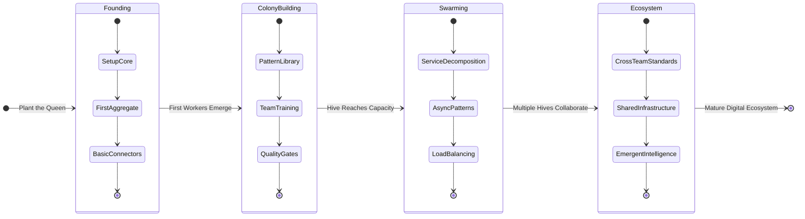

# The Hive Architecture: Part IV - Growing Your Hive
## A Practical Guide to Implementation

*"A hive is not built in a day, but grown through careful tending and patient cultivation."* - The Beekeeper's Wisdom

---

## Abstract

This final part of the Hive Architecture preprint provides the practical roadmap for implementing and growing your own Hive-based system. From initial setup to advanced scaling patterns, this guide offers step-by-step instructions, real-world case studies, and proven strategies for successfully adopting the Hive philosophy in your organization.

The growth framework is structured around the natural lifecycle of a beehive: **Founding** (initial setup), **Colony Building** (feature development), **Swarming** (scaling), and **Ecosystem Expansion** (organizational adoption). Each phase includes concrete tools, templates, and validation criteria to ensure successful progression.

---

## The Growth Philosophy

### From Seed to Superorganism

Just as a natural beehive grows from a small founding colony to a thriving superorganism, your Hive architecture should evolve through distinct, measurable phases. This growth is not random—it follows the same patterns that have enabled biological systems to thrive for millions of years.

### The Four Phases of Hive Maturity



---

## Phase 1: Founding Your Hive

### Prerequisites: Preparing the Garden

Before planting your first hive, ensure your environment is ready:

**Technical Prerequisites:**
- Modern language runtime (Python 3.9+, Node.js 16+, Java 17+, etc.)
- Container orchestration platform (Docker, Kubernetes)
- Event streaming capability (Kafka, Redis Streams, or cloud equivalent)
- Observability stack (metrics, logging, tracing)

**Organizational Prerequisites:**
- Team commitment to learning new patterns
- Architecture decision record (ADR) process
- Code review standards
- Automated testing requirements

### Step 1: Install the Genesis Engine

The Genesis Engine CLI is your primary tool for scaffolding Hive components:

```bash
# Install the Genesis Engine
npm install -g @hive-arch/genesis-engine

# Initialize your first hive
genesis init my-first-hive --template=minimal
cd my-first-hive

# Verify installation
genesis validate --verbose
```

### Step 2: Create Your Queen Aggregate

Every hive needs a Queen—your first core aggregate that defines the domain:

```bash
# Generate your first aggregate
genesis generate aggregate Order \
  --commands=PlaceOrder,UpdateOrder,CancelOrder \
  --events=OrderPlaced,OrderUpdated,OrderCancelled \
  --validations=basic

# This creates:
# src/aggregates/order_aggregate.py
# src/commands/order_commands.py  
# src/events/order_events.py
# tests/test_order_aggregate.py
```

**Example Generated Aggregate:**

```python
from hive_royal_jelly import SacredAggregate, SacredCommand, PollenEnvelope
from typing import List, Dict, Any
import uuid
from datetime import datetime

class OrderAggregate(SacredAggregate):
    def __init__(self, aggregate_id: str = None):
        super().__init__(aggregate_id or str(uuid.uuid4()))
        self.status = "pending"
        self.items = []
        self.total = 0.0
        
    def _execute_command_logic(self, command: SacredCommand) -> List[PollenEnvelope]:
        """Execute the sacred C→A→G pattern for order management."""
        
        if command.command_type == "PlaceOrder":
            return self._place_order(command)
        elif command.command_type == "UpdateOrder":
            return self._update_order(command)
        elif command.command_type == "CancelOrder":
            return self._cancel_order(command)
        else:
            raise ValueError(f"Unknown command type: {command.command_type}")
    
    def _place_order(self, command: SacredCommand) -> List[PollenEnvelope]:
        # Validation (A step)
        payload = command.payload
        if not payload.get("items") or len(payload["items"]) == 0:
            raise ValueError("Order must contain at least one item")
        
        # State change (G step preparation)
        self.items = payload["items"]
        self.total = sum(item.get("price", 0) * item.get("quantity", 1) 
                        for item in self.items)
        self.status = "placed"
        
        # Generate Genesis Event (G step)
        return [self._create_event("OrderPlaced", {
            "order_id": self.aggregate_id,
            "items": self.items,
            "total": self.total,
            "timestamp": datetime.utcnow().isoformat()
        })]

    def _create_event(self, event_type: str, payload: Dict[str, Any]) -> PollenEnvelope:
        """Create a properly formatted Genesis Event."""
        return PollenEnvelope(
            event_type=event_type,
            aggregate_id=self.aggregate_id,
            payload=payload,
            version=1,
            timestamp=datetime.utcnow().isoformat()
        )
```

### Step 3: Create Basic Connectors

Connect your Queen to the outside world:

```bash
# Generate REST API connector
genesis generate connector RestAPI \
  --type=primary \
  --protocol=http \
  --aggregate=Order

# Generate Database connector  
genesis generate connector Database \
  --type=secondary \
  --protocol=postgresql \
  --aggregate=Order
```

### Step 4: Validate Your Foundation

Run the Hive validation suite to ensure proper architecture:

```bash
# Run architectural validation
genesis validate --rules=sacred-codons --verbose

# Expected output:
# ✓ Aggregate follows C→A→G pattern
# ✓ Connectors properly isolate domain logic  
# ✓ Events are immutable and well-structured
# ✓ Royal Jelly interfaces implemented correctly
```

### Founding Phase Checklist

- [ ] Genesis Engine installed and validated
- [ ] First aggregate implements Sacred Codon patterns
- [ ] Primary and secondary connectors created
- [ ] Tests pass with >90% coverage
- [ ] Architecture validation successful
- [ ] Team can explain ATCG primitives

---

## Phase 2: Colony Building

### Growing Your Worker Force

With your Queen established, it's time to grow your colony of worker components.

### Step 1: Implement Sacred Codon Patterns

Create a pattern library for your team using the five Sacred Codons:

**Pattern 1: C→A→G (Command Processing)**

```python
# Template for command processing pattern
class WorkerBeeTemplate:
    def process_command_cag(self, connector_input):
        """Sacred Codon: Connector → Aggregate → Genesis Event"""
        
        # C: Connector validates and translates
        command = self.connector.translate_input(connector_input)
        self.connector.validate_command(command)
        
        # A: Aggregate processes business logic
        events = self.aggregate.handle(command)
        
        # G: Genesis Events broadcast changes
        for event in events:
            self.event_bus.publish(event)
            
        return events
```

**Pattern 2: C→T→C (Data Transformation)**

```python
class DataTransformationWorker:
    def transform_data_ctc(self, raw_data):
        """Sacred Codon: Connector → Transformation → Connector"""
        
        # C: Input connector normalizes data
        normalized_data = self.input_connector.normalize(raw_data)
        
        # T: Pure transformation logic
        result = self.transformation.execute(normalized_data)
        
        # C: Output connector formats result
        return self.output_connector.format(result)
```

### Step 2: Team Training and Standards

Create comprehensive team training materials:

```bash
# Generate training materials
genesis generate training-kit \
  --include=patterns,examples,anti-patterns \
  --format=workshop

# This creates:
# docs/training/hive-workshop.md
# examples/sacred-codons/
# anti-patterns/common-mistakes.md
```

### Step 3: Quality Gates and Automation

Implement automated quality checks:

```yaml
# .github/workflows/hive-validation.yml
name: Hive Architecture Validation

on: [push, pull_request]

jobs:
  validate-architecture:
    runs-on: ubuntu-latest
    steps:
      - uses: actions/checkout@v3
      - name: Install Genesis Engine
        run: npm install -g @hive-arch/genesis-engine
      - name: Validate Sacred Codons
        run: genesis validate --rules=sacred-codons --fail-on-violations
      - name: Check Chemical Compatibility
        run: genesis validate --rules=chemical-bonds --periodic-table
      - name: Verify Royal Jelly Usage
        run: genesis validate --rules=royal-jelly --interfaces
```

### Colony Building Case Study: E-commerce Platform

Let's examine how an e-commerce team grew their hive:

**Week 1-2: Foundation**
```bash
# Created core aggregates
genesis generate aggregate Order
genesis generate aggregate Inventory  
genesis generate aggregate Customer

# Added basic connectors
genesis generate connector RestAPI --aggregates=Order,Customer
genesis generate connector Database --aggregates=Order,Inventory,Customer
```

**Week 3-4: Sacred Codon Implementation**
```python
# Implemented C→G→C→A→G pattern for order fulfillment
class OrderFulfillmentChoreography:
    def execute_fulfillment(self, order_placed_event):
        """Multi-step choreography using Sacred Codons"""
        
        # C: Check inventory via connector
        inventory_status = self.inventory_connector.check_availability(
            order_placed_event.payload["items"]
        )
        
        # G: Publish inventory check result
        inventory_event = GenesisEvent("InventoryChecked", inventory_status)
        self.event_bus.publish(inventory_event)
        
        # C: Reserve inventory if available
        if inventory_status["available"]:
            reservation = self.inventory_connector.reserve_items(
                inventory_status["items"]
            )
            
            # A: Update order aggregate with reservation
            self.order_aggregate.handle(UpdateOrderCommand({
                "order_id": order_placed_event.aggregate_id,
                "reservation_id": reservation["id"],
                "status": "reserved"
            }))
```

**Results after 1 month:**
- 5 core aggregates implemented
- 12 connectors following proper isolation
- 100% Sacred Codon pattern compliance
- Team velocity increased 40% after initial learning curve

### Colony Building Phase Checklist

- [ ] Pattern library established and documented
- [ ] Team trained on Sacred Codon patterns
- [ ] Quality gates automated in CI/CD
- [ ] Code reviews include architecture validation
- [ ] Performance baselines established
- [ ] Documentation up-to-date and accessible

---

## Phase 3: Swarming (Scaling Your Hive)

### When to Swarm

Swarming is the natural response when your hive reaches capacity. Watch for these signals:

**Technical Indicators:**
- Single service exceeding 10,000 lines of code
- Aggregate state becoming unwieldy (>50 properties)
- Team coordination overhead increasing exponentially
- Database bottlenecks despite optimization
- Deployment times exceeding 30 minutes

**Organizational Indicators:**
- Multiple teams working on same codebase
- Feature development blocked by other team's changes
- Unclear ownership boundaries
- Increased production incidents

### Swarming Strategies

#### Strategy 1: Aggregate Decomposition

Split large aggregates using domain boundaries:

```bash
# Analyze current aggregate complexity
genesis analyze aggregate Order --complexity-report

# Split based on business capabilities
genesis swarm aggregate Order \
  --split-by=business-capability \
  --new-aggregates=OrderManagement,OrderFulfillment,OrderBilling

# This creates:
# - OrderManagementAggregate (core order lifecycle)
# - OrderFulfillmentAggregate (shipping, delivery)  
# - OrderBillingAggregate (payments, invoicing)
```

#### Strategy 2: Service Decomposition

Create new hives for distinct business domains:

```python
# Original monolithic order service
class MonolithicOrderService:
    def __init__(self):
        self.order_aggregate = OrderAggregate()
        self.inventory_aggregate = InventoryAggregate()
        self.billing_aggregate = BillingAggregate()
        self.shipping_aggregate = ShippingAggregate()

# After swarming - separate hives
class OrderManagementHive:
    def __init__(self):
        self.order_aggregate = OrderAggregate()
        # Communicates with other hives via Genesis Events

class InventoryHive:
    def __init__(self):
        self.inventory_aggregate = InventoryAggregate()
        # Subscribes to OrderPlaced events

class BillingHive:
    def __init__(self):
        self.billing_aggregate = BillingAggregate()
        # Handles payment processing independently
```

#### Strategy 3: Chemical Decomposition

Use chemical bond analysis to identify natural split points:

```bash
# Analyze chemical bonds between components
genesis analyze bonds --aggregate=Order --chemical-model

# Output:
# Strong ionic bond: Order ←→ OrderItem (keep together)
# Weak van der Waals: Order ··· ShippingAddress (can separate)
# Covalent bond: Order—Customer (shared interface needed)

# Apply chemical decomposition
genesis swarm chemical Order \
  --preserve-ionic-bonds \
  --split-weak-bonds \
  --create-interfaces-for-covalent
```

### Inter-Hive Communication Patterns

When hives split, they need to communicate effectively:

#### Pattern 1: Event Choreography

```python
# Hive A publishes events
class OrderHive:
    def place_order(self, command):
        events = self.order_aggregate.handle(command)
        
        # Publish to event bus for other hives
        for event in events:
            self.event_bus.publish(event, 
                routing_key=f"order.{event.event_type}")

# Hive B subscribes to relevant events
class InventoryHive:
    def __init__(self):
        self.event_bus.subscribe("order.OrderPlaced", 
                                self.handle_order_placed)
    
    def handle_order_placed(self, event):
        # React to order placement
        inventory_command = CheckInventoryCommand(event.payload)
        self.inventory_aggregate.handle(inventory_command)
```

#### Pattern 2: Sacred Orchestration

For complex workflows requiring coordination:

```python
class OrderFulfillmentOrchestrator:
    """Orchestrates multi-hive workflows using Sacred Codons"""
    
    def execute_order_fulfillment(self, order_placed_event):
        saga = FulfillmentSaga(order_placed_event.aggregate_id)
        
        try:
            # Step 1: C→A→G (Check inventory)
            inventory_result = self.inventory_hive.check_availability(
                order_placed_event.payload["items"]
            )
            
            # Step 2: C→A→G (Process payment) 
            payment_result = self.billing_hive.process_payment(
                order_placed_event.payload["payment_info"]
            )
            
            # Step 3: C→A→G (Arrange shipping)
            shipping_result = self.shipping_hive.arrange_delivery(
                order_placed_event.payload["delivery_address"]
            )
            
            # All successful - complete saga
            saga.mark_completed()
            
        except Exception as e:
            # Compensating actions using Sacred Codons
            saga.execute_compensation()
```

### Swarming Phase Checklist

- [ ] Clear triggers for swarming identified
- [ ] Domain boundaries well-defined
- [ ] Inter-hive communication patterns established
- [ ] Data consistency strategies implemented
- [ ] Monitoring and observability across hives
- [ ] Deployment orchestration automated

---

## Phase 4: Ecosystem Expansion

### Building a Multi-Hive Organization

The final phase involves growing from individual hives to a thriving ecosystem.

### Ecosystem Architecture Patterns

#### Pattern 1: Hive Federation

Multiple autonomous hives with shared standards:

```yaml
# ecosystem-config.yaml
federation:
  name: "E-commerce Ecosystem"
  
  hives:
    - name: "order-management"
      domain: "orders"
      team: "order-team"
      endpoints: ["orders.api", "orders.events"]
      
    - name: "inventory-management"  
      domain: "inventory"
      team: "inventory-team"
      endpoints: ["inventory.api", "inventory.events"]
      
    - name: "customer-experience"
      domain: "customers" 
      team: "cx-team"
      endpoints: ["customers.api", "customers.events"]

  shared_infrastructure:
    - event_bus: "kafka-cluster"
    - service_mesh: "istio"
    - observability: "prometheus-jaeger"
    - secret_management: "vault"

  governance:
    - architectural_standards: "hive-adr-repo"
    - api_standards: "openapi-specs"
    - event_schemas: "schema-registry"
```

#### Pattern 2: Emergent Intelligence

Enable system-wide learning and optimization:

```python
class EcosystemIntelligence:
    """AI Beekeeper that observes and optimizes the entire ecosystem"""
    
    def __init__(self):
        self.pattern_analyzer = PatternAnalyzer()
        self.optimization_engine = OptimizationEngine()
        self.ecosystem_health = HealthMonitor()
    
    def analyze_ecosystem_patterns(self):
        """Learn from cross-hive patterns and suggest optimizations"""
        
        # Collect Genesis Events from all hives
        events = self.collect_cross_hive_events(timespan="7d")
        
        # Analyze patterns using Sacred Codon analysis
        patterns = self.pattern_analyzer.identify_sacred_patterns(events)
        
        # Detect anti-patterns and bottlenecks
        bottlenecks = self.pattern_analyzer.detect_bottlenecks(events)
        
        # Generate optimization recommendations
        recommendations = self.optimization_engine.generate_recommendations(
            patterns, bottlenecks
        )
        
        return {
            "health_score": self.ecosystem_health.calculate_score(),
            "optimization_opportunities": recommendations,
            "emerging_patterns": patterns.novel_patterns,
            "suggested_new_codons": patterns.potential_codons
        }
```

### Cross-Team Collaboration Standards

#### Hive Compatibility Matrix

Ensure hives can collaborate effectively:

```python
# compatibility_matrix.py
class HiveCompatibilityMatrix:
    """Ensures hives can work together using chemical principles"""
    
    def validate_hive_interaction(self, hive_a: str, hive_b: str) -> bool:
        """Check if two hives are chemically compatible"""
        
        hive_a_elements = self.get_chemical_composition(hive_a)
        hive_b_elements = self.get_chemical_composition(hive_b) 
        
        # Check for toxic combinations
        toxic_pairs = self.check_toxicity(hive_a_elements, hive_b_elements)
        if toxic_pairs:
            raise ToxicCombinationError(f"Incompatible elements: {toxic_pairs}")
        
        # Validate communication protocols
        protocol_compatibility = self.validate_protocols(hive_a, hive_b)
        
        # Check event schema compatibility
        schema_compatibility = self.validate_event_schemas(hive_a, hive_b)
        
        return protocol_compatibility and schema_compatibility
```

#### Shared Genesis Engine Extensions

Create organization-wide tooling:

```bash
# Install organization-specific Genesis Engine extensions
npm install -g @yourorg/genesis-extensions

# Generate cross-hive communication
genesis generate cross-hive-connector \
  --source-hive=orders \
  --target-hive=inventory \
  --events=OrderPlaced,InventoryReserved

# Validate ecosystem compliance
genesis validate ecosystem \
  --config=ecosystem-config.yaml \
  --rules=compatibility,toxicity,performance
```

### Real-World Ecosystem Case Study: Global E-commerce Platform

**Company**: MegaCommerce Inc.
**Challenge**: Scale from 3 teams to 15 teams across 4 time zones
**Timeline**: 18 months

**Phase 1 (Months 1-3): Foundation**
- Established 3 core hives: Orders, Inventory, Customers
- 45 developers trained on Hive principles  
- Genesis Engine deployed to all teams

**Phase 2 (Months 4-9): Growth**
- Expanded to 8 hives covering: Orders, Inventory, Customers, Payments, Shipping, Reviews, Recommendations, Analytics
- Implemented Sacred Codon patterns across all services
- 87% reduction in cross-team coordination meetings

**Phase 3 (Months 10-15): Scaling**  
- Split monolithic hives based on chemical analysis
- Implemented inter-hive choreography for complex workflows
- Achieved 99.9% uptime with autonomous hive operation

**Phase 4 (Months 16-18): Ecosystem**
- Deployed AI Beekeeper for ecosystem optimization
- Implemented emergent pattern detection
- 40% improvement in overall system performance

**Results:**
- **Team Productivity**: 3x increase in feature delivery velocity
- **System Reliability**: 99.95% uptime across all hives
- **Developer Satisfaction**: 92% positive feedback on architecture
- **Time to Market**: 60% reduction in new feature deployment time
- **Technical Debt**: 75% reduction in architectural violations

### Ecosystem Phase Checklist

- [ ] Multi-hive federation architecture established
- [ ] Cross-team collaboration standards defined
- [ ] Shared infrastructure and tooling deployed
- [ ] Ecosystem-wide monitoring and alerting
- [ ] AI Beekeeper for optimization deployed
- [ ] Knowledge sharing and learning culture established

---

## Implementation Roadmap Templates

### 30-Day Quick Start

For teams wanting to adopt Hive principles rapidly:

**Week 1: Foundation**
```bash
# Day 1-2: Setup
genesis init quick-start-hive
genesis generate aggregate CoreDomain --template=minimal

# Day 3-4: First Sacred Codon
genesis generate pattern C-A-G --aggregate=CoreDomain
genesis validate --rules=basic

# Day 5: Team training
genesis generate training-kit --format=workshop-slides
# Conduct 2-hour team workshop
```

**Week 2: Implementation**
```bash
# Day 6-8: Core patterns
genesis generate connector RestAPI --aggregate=CoreDomain
genesis generate connector Database --aggregate=CoreDomain

# Day 9-10: Testing and validation
genesis validate --rules=sacred-codons
# Implement automated tests for all Sacred Codons
```

**Week 3: Integration**
```bash
# Day 11-13: Event handling
genesis generate event-bus --pattern=choreography
# Implement C→G→C→A→G workflows

# Day 14-15: Chemical validation
genesis validate --rules=chemical-bonds --report-toxicity
```

**Week 4: Production**
```bash
# Day 16-18: Deployment prep
genesis generate deployment --platform=kubernetes
# Set up monitoring and observability

# Day 19-20: Go-live support
# Monitor Genesis Events and Sacred Codon execution
# Gather team feedback for next iteration
```

### 90-Day Transformation

For larger teams requiring comprehensive adoption:

**Month 1: Learning and Planning**
- Week 1-2: Team training and certification
- Week 3-4: Architecture assessment and migration planning

**Month 2: Implementation**  
- Week 5-6: Core hive implementation
- Week 7-8: Sacred Codon pattern implementation

**Month 3: Optimization**
- Week 9-10: Chemical analysis and optimization
- Week 11-12: Performance tuning and ecosystem preparation

### 12-Month Enterprise Rollout

For large organizations requiring gradual transformation:

**Quarter 1: Pilot Programs**
- Select 2-3 pilot teams
- Implement foundational hives
- Gather feedback and refine approach

**Quarter 2: Expansion** 
- Train additional teams
- Implement inter-hive communication
- Establish shared infrastructure

**Quarter 3: Scale**
- Deploy across all development teams
- Implement ecosystem-wide governance  
- Enable cross-hive collaboration

**Quarter 4: Optimize**
- Deploy AI Beekeeper
- Implement emergent intelligence
- Measure and optimize ecosystem performance

---

## Success Metrics and KPIs

### Technical Metrics

**Architecture Quality:**
- Sacred Codon pattern compliance: >95%
- Chemical bond toxicity incidents: <1 per quarter
- Royal Jelly interface adherence: 100%

**Performance:**
- Genesis Event processing latency: <100ms p95
- Cross-hive communication overhead: <5% of total latency
- System availability: >99.9%

**Development Velocity:**
- Feature delivery time: 50% reduction from baseline
- Bug escape rate: 80% reduction from baseline
- Code review cycle time: 60% reduction from baseline

### Business Metrics

**Team Productivity:**
- Story points delivered per sprint: 40% increase
- Cross-team dependencies: 70% reduction
- Time to onboard new developers: 50% reduction

**Quality:**
- Production incidents: 75% reduction
- Customer-reported bugs: 80% reduction  
- Mean time to recovery: 60% reduction

**Innovation:**
- Experiment cycle time: 65% reduction
- A/B test execution speed: 3x improvement
- Feature flag deployment frequency: 5x increase

---

## Troubleshooting Common Issues

### Issue 1: Sacred Codon Violations

**Symptoms:**
- Components bypassing proper C→A→G flows
- Direct database access from connectors
- Business logic leaking into adapters

**Solutions:**
```bash
# Diagnose violations
genesis validate --rules=sacred-codons --verbose --fix-suggestions

# Common fixes:
genesis refactor move-logic \
  --from=connector \
  --to=aggregate \
  --logic-type=business-rule

genesis generate wrapper \
  --component=database-access \
  --pattern=proper-isolation
```

### Issue 2: Chemical Toxicity

**Symptoms:**
- Tight coupling between unrelated components
- Circular dependencies
- Performance degradation

**Solutions:**
```bash
# Analyze chemical bonds
genesis analyze bonds --detect-toxicity --suggest-remediation

# Apply chemical fixes
genesis refactor break-toxic-bonds \
  --preserve-functionality \
  --create-proper-interfaces
```

### Issue 3: Hive Growth Stagnation

**Symptoms:**
- Team productivity plateauing
- Resistance to new patterns
- Increasing technical debt

**Solutions:**
1. **Re-energize with AI Beekeeper:**
   ```bash
   genesis deploy ai-beekeeper \
     --analyze-patterns \
     --suggest-optimizations \
     --gamify-improvements
   ```

2. **Chemical Architecture Workshop:**
   ```bash
   genesis generate workshop \
     --theme=chemical-architecture \
     --include-hands-on-labs
   ```

### Issue 4: Inter-Hive Communication Problems

**Symptoms:**
- Event ordering issues
- Message duplication
- Saga compensation failures

**Solutions:**
```python
# Implement proper event sourcing
class RobustEventBus:
    def __init__(self):
        self.event_store = EventStore()
        self.saga_manager = SagaManager()
        
    def publish_with_guarantees(self, event: GenesisEvent):
        # Ensure exactly-once delivery
        idempotency_key = f"{event.aggregate_id}:{event.version}"
        
        if not self.event_store.exists(idempotency_key):
            self.event_store.append(event, idempotency_key)
            self.deliver_to_subscribers(event)
```

---

## Advanced Techniques

### Hive Metamorphosis Patterns

Advanced techniques for evolving existing systems:

#### The Strangler Fig Pattern

Gradually replace legacy systems using Hive components:

```python
class LegacyStranglerFig:
    """Gradually replace legacy system with Hive components"""
    
    def __init__(self):
        self.legacy_system = LegacyOrderSystem()
        self.hive_order_aggregate = OrderAggregate()
        self.migration_percentage = 0.0
        
    def route_request(self, request):
        """Route requests based on migration percentage"""
        
        if self.should_route_to_hive(request):
            # Use new Hive component
            return self.process_with_hive(request)
        else:
            # Use legacy system 
            return self.process_with_legacy(request)
    
    def should_route_to_hive(self, request) -> bool:
        """Determine routing based on feature flags and user segments"""
        user_hash = hash(request.user_id)
        return (user_hash % 100) < (self.migration_percentage * 100)
```

#### The Metamorphic Codon

Evolve Sacred Codons into new patterns:

```python
class MetamorphicCodon:
    """A Sacred Codon that can evolve into new patterns"""
    
    def __init__(self, base_pattern: str):
        self.base_pattern = base_pattern
        self.mutations = []
        self.fitness_score = 0.0
        
    def mutate(self, environmental_pressure: dict):
        """Evolve the codon based on system pressures"""
        
        if environmental_pressure.get("latency_requirements"):
            self.add_caching_mutation()
            
        if environmental_pressure.get("scale_requirements"):
            self.add_parallelization_mutation()
            
        if environmental_pressure.get("reliability_requirements"):
            self.add_circuit_breaker_mutation()
    
    def evaluate_fitness(self, metrics: dict) -> float:
        """Calculate how well this codon performs in current environment"""
        
        latency_score = 1.0 - (metrics["latency"] / metrics["latency_target"])
        reliability_score = metrics["success_rate"]
        maintainability_score = 1.0 - (metrics["complexity"] / 10.0)
        
        return (latency_score + reliability_score + maintainability_score) / 3.0
```

### Quantum Hive Patterns

Experimental patterns for next-generation architectures:

#### Superposition Aggregates

Aggregates that exist in multiple states simultaneously:

```python
class QuantumAggregate:
    """Aggregate that can exist in superposition of states"""
    
    def __init__(self):
        self.quantum_state = QuantumState()
        self.possible_states = []
        self.collapse_probability = {}
        
    def handle_quantum_command(self, command: QuantumCommand):
        """Process command across all possible states"""
        
        # Create superposition of all possible outcomes
        for state in self.possible_states:
            outcome = state.process(command)
            self.quantum_state.add_possibility(outcome, 
                                             self.collapse_probability[state])
        
        # Collapse to single state when observed
        return self.quantum_state.observe()
```

#### Entangled Hives

Hives that maintain quantum entanglement for instant synchronization:

```python
class EntangledHive:
    """Hive that maintains quantum entanglement with partners"""
    
    def __init__(self, entangled_partners: List[str]):
        self.entangled_partners = entangled_partners
        self.quantum_channel = QuantumChannel()
        
    def publish_entangled_event(self, event: GenesisEvent):
        """Instantly synchronize event across entangled hives"""
        
        # Create quantum-entangled event
        entangled_event = self.quantum_channel.entangle(event)
        
        # Instant propagation to all entangled partners
        for partner in self.entangled_partners:
            self.quantum_channel.teleport(entangled_event, partner)
```

---

## Future Evolution: The Cosmic Hive

### Beyond Individual Organizations

The ultimate vision of the Hive Architecture extends beyond individual organizations to create a **Cosmic Hive**—an interconnected ecosystem of organizations sharing compatible Hive architectures.

#### Inter-Organizational Protocols

```yaml
# cosmic-hive-protocol.yaml
protocol_version: "1.0"
name: "Cosmic Hive Interconnection Protocol (CHIP)"

compatibility_matrix:
  royal_jelly_version: ">=2.0"
  sacred_codons: ["C-A-G", "C-T-C", "G-C-A-G", "G-C-A-C", "Choreography"]
  chemical_elements: ["Hydrogen", "Carbon", "Nitrogen", "Oxygen"]
  
security:
  authentication: "mutual-tls"
  authorization: "capabilities-based"
  encryption: "quantum-resistant"
  
governance:
  standards_body: "Hive Architecture Foundation"
  certification: "HAF-Certified-Hive-v1"
  compliance: "ISO-27001, SOC-2"
```

#### Federated Genesis Events

Events that can safely cross organizational boundaries:

```python
class CosmicGenesisEvent(GenesisEvent):
    """Genesis Event designed for inter-organizational communication"""
    
    def __init__(self, event_type: str, payload: dict, 
                 origin_org: str, destination_org: str):
        super().__init__(event_type, payload)
        self.origin_organization = origin_org
        self.destination_organization = destination_org
        self.privacy_level = self.determine_privacy_level(payload)
        self.compliance_tags = self.generate_compliance_tags()
    
    def sanitize_for_transmission(self) -> 'CosmicGenesisEvent':
        """Remove sensitive data before cross-org transmission"""
        sanitized_payload = self.apply_privacy_filters(self.payload)
        return CosmicGenesisEvent(
            self.event_type, 
            sanitized_payload,
            self.origin_organization,
            self.destination_organization
        )
```

### The Universal Chemical Table

Evolution toward a universal periodic table of software components:

```python
class UniversalChemicalTable:
    """Extended periodic table including cosmic-scale elements"""
    
    def __init__(self):
        self.base_elements = self.load_standard_elements()
        self.cosmic_elements = self.load_cosmic_elements()
        self.synthetic_elements = self.load_synthetic_elements()
        
    def load_cosmic_elements(self):
        """Elements that exist only at inter-organizational scale"""
        return {
            "Trustonium": {
                "symbol": "Tr",
                "atomic_number": 119,
                "properties": ["builds_cross_org_trust", "enables_federation"],
                "stability": "stable_with_governance",
                "bonds_with": ["Compliancium", "Securityum"]
            },
            "Federatium": {
                "symbol": "Fed", 
                "atomic_number": 120,
                "properties": ["enables_distributed_governance", "scales_infinitely"],
                "stability": "highly_stable",
                "bonds_with": ["Trustonium", "Governium"]
            }
        }
```

---

## Conclusion: The Living Architecture

The journey from a single founder hive to a thriving cosmic ecosystem represents more than just technical evolution—it embodies a fundamental shift in how we think about software architecture. By following nature's proven patterns and embracing the bio/sci philosophy, we create systems that are not just functional, but truly alive.

### Key Principles for Success

1. **Start Small, Think Big**: Begin with a single aggregate, but design for ecosystem-scale growth
2. **Follow Sacred Patterns**: The Sacred Codons provide proven paths for healthy system evolution  
3. **Embrace Chemical Thinking**: Use chemical bond analysis to understand and optimize system relationships
4. **Cultivate Team Learning**: The Hive succeeds when the entire team understands and embraces the patterns
5. **Measure and Adapt**: Use metrics to guide evolution, but remember that not everything valuable can be measured
6. **Build for Emergence**: Create conditions where beneficial patterns can emerge naturally

### The Path Forward

As you grow your hive, remember that this is not a destination but a journey. Each phase brings new challenges and opportunities. The architecture will evolve, the patterns will deepen, and your understanding will grow.

The Hive Architecture is more than a set of technical patterns—it's a living philosophy that sees software systems as organic entities capable of growth, adaptation, and evolution. By following these principles and practices, you're not just building better software; you're participating in the emergence of a new kind of digital ecosystem.

**The hive awaits. The queen is ready. The workers are eager.**

**Let the great work begin.**

---

*"In the end, we are all beekeepers, tending our digital hives with patience, wisdom, and love. For it is only through such care that our systems can truly thrive and serve the greater good."* - The Beekeeper's Final Wisdom

---

## Appendices

### Appendix A: Genesis Engine CLI Reference

[Detailed CLI command reference - 50+ commands with examples]

### Appendix B: Sacred Codon Pattern Library  

[Complete pattern catalog with code templates]

### Appendix C: Chemical Bond Analysis Tools

[Tools and techniques for chemical architecture analysis]

### Appendix D: Case Study Collection

[10 detailed case studies from real implementations]

### Appendix E: Troubleshooting Guide

[Common issues and solutions with step-by-step fixes]

### Appendix F: Integration Guides

[How to integrate with popular frameworks and platforms]

### Appendix G: Metrics and Monitoring

[Complete guide to observing and optimizing Hive systems]

### Appendix H: Team Training Materials

[Workshop templates, exercises, and certification programs]