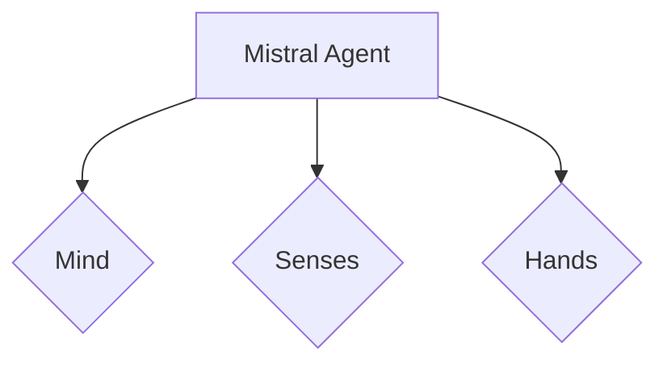

# Mistral Agent Configuration

This file contains the configuration for the Mistral Agent, embedded within a Mermaid diagram to maintain the thematic consistency of the Hive.

## Agent Identity & Style

